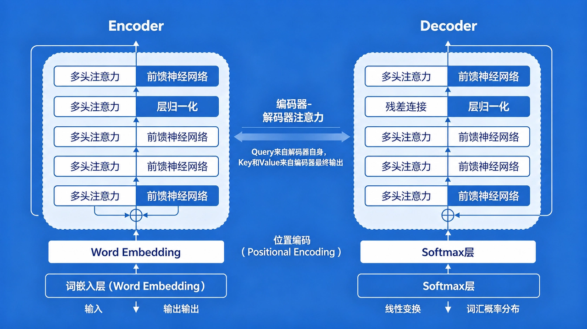

# AI 大模型与前端开发：从技术原理到团队落地完全指南

> 本文系统梳理了 AI 大模型在前端开发领域的核心技术、工具矩阵、提示词工程方法论以及团队规模化落地实践，适合作为前端工程师拥抱 AI 浪潮的全面学习资料。

---

## 一、Transformer：AI 编程的底层技术革命

### 1.1 为什么 AI 突然"开窍"了？

答案藏在 2017 年 Google 的论文《**Attention Is All You Need**》中——**Transformer 架构**。

传统 **RNN** 像一个人逐行读代码，上一行看不完就没法看下一行，越往后越容易忘记前面。而 **Transformer 允许模型一次性"扫视"整段代码**，同时计算每一个词与所有其他词之间的关联权重。正是这种**全局理解能力**，让 AI 能够把握函数之间的调用关系、变量的作用域以及复杂的条件分支逻辑。

### 1.2 核心架构：编码器-解码器结构

Transformer 采用经典的**编码器-解码器对称结构**：



- **编码器（Encoder）**：左侧，由 6 层相同子结构堆叠而成，负责理解输入序列
- **解码器（Decoder）**：右侧，同样 6 层，负责生成输出序列
- 编码器和解码器之间通过**注意力桥接**：解码器中有一个额外的"编码器-解码器注意力"子层，Query 来自解码器自身，Key 和 Value 来自编码器的最终输出
- 输入输出都先经过**词嵌入层（Word Embedding）**，再叠加**位置编码（Positional Encoding）**

每个编码器层内部由两个子层堆叠构成：

1. **多头自注意力（Multi-Head Self-Attention）**——捕捉序列内各位置之间的依赖关系
2. **全连接前馈网络（Feed-Forward Network）**——做非线性变换

每个子层周围都有一个**残差连接（Add）**，随后紧跟**层归一化（Norm）**。残差连接解决深层网络中的梯度消失问题，层归一化保证训练稳定性。

### 1.3 自注意力机制：Transformer 的"心脏"

自注意力的计算分为四个步骤：

1. **线性映射生成 Q/K/V**：输入序列 X 通过三个可学习的权重矩阵 W^Q、W^K、W^V，分别映射为 Query（"我要找什么"）、Key（"我有什么特征"）、Value（"我携带的信息"）
2. **相似度分数计算**：Query 与 Key 的转置做点积，得到注意力分数矩阵，再除以 √d_k 进行缩放，防止 Softmax 梯度消失
3. **Softmax 归一化**：对每行应用 Softmax，得到归一化的注意力权重（每行权重之和为 1）
4. **加权聚合**：权重矩阵与 Value 矩阵相乘，得到最终输出——每个位置的输出是所有位置 Value 的加权和

### 1.4 为什么 Transformer 适合编程？

**代码具有双重性质**：它既是自然语言（变量名、注释、文档字符串），又是形式语言（语法严格、逻辑精确）。Transformer 恰好能同时处理这两种性质，这就是它成为编程 AI 基石的根本原因。

此外，Transformer **天然支持并行计算**，这让训练千亿参数级别的模型成为可能。从 GPT-1 的 1.17 亿参数到 GPT-5.5 的万亿级参数，代码能力的提升是**指数级**的。

---

## 二、编程 AI 的四代演进

| 代际 | 时间 | 代表能力 | 提效幅度 | 开发者角色 |
|------|------|---------|---------|-----------|
| **第一代** | ~2020 | 基于 AST 的静态补全 | <10% | 纯手工编码 |
| **第二代** | 2021-2023 | GitHub Copilot，行/块补全 | 20-30% | 被动接受建议 |
| **第三代** | 2023-2024 | 对话式生成完整函数/组件 | 50-100% | 从"写"转向"改" |
| **第四代** | 2025-至今 | 自主计划-执行-验证-修复 | 300-500% | 系统设计+结果审查 |

**第四代的核心特征**：GPT-5.5 Codex 和 Claude 4.7 Opus 具备了完整的**工具调用能力**——读取文件、修改代码、运行终端命令、执行测试并根据结果自我修复，形成"**计划-执行-验证-修复**"的闭环。

---

## 三、前端行业的 AI 变局

2026 年，全球 **92% 的前端团队**已全面采用 AI 辅助开发，平均**交付周期缩短 62%**。更重要的变化是能力边界的拓展——借助 AI，前端工程师可以快速覆盖**全栈开发、UI 设计、自动化测试甚至部分 DevOps 工作**。

开发模式正在从"**手工作坊式**"转向"**AI 辅助工业化**"开发。我们不再逐行敲代码，而是用自然语言描述意图，AI 生成初稿，我们审查、调整、合并。

**团队战略建议**：
1. 把 AI 作为**核心生产力工具**，像对待 Git 和 CI/CD 一样纳入日常工作流
2. **重新定义能力模型**——系统设计、需求拆解、代码审查的重要性远超手写代码速度
3. 建立**统一的 AI 能力体系**，避免团队内出现巨大效率差异

---

## 四、高级提示词工程：前端专属方法论

### 4.1 四条核心原则

**原则一：角色设定**

AI 是一个极其擅长角色扮演的引擎。明确告诉它"你是谁"：

> "你是一位拥有 10 年经验的资深前端架构师，精通 React、TypeScript 和性能优化。你编写的代码必须符合行业最佳实践，具有良好的可读性、可维护性和性能。"

**原则二：清晰明确**

不要只说"帮我写个登录表单"，而要具体说明：表单包含哪些字段？验证规则是什么？提交后如何处理？是否需要加载状态和错误提示？

**原则三：分步拆解**

复杂任务不要一次性抛出所有要求。先让 AI 分析问题，再设计技术方案，最后生成代码。每一步都可以单独审查和调整。

**原则四：反馈迭代**

AI 的输出很少第一次就完美。指出哪里不对、期望改成什么样，然后让它重新生成。经过两三轮迭代，质量通常会大幅提升。

### 4.2 前端专属提示词模板库

**组件生成模板**：

```
生成一个React函数式组件，要求：
- 组件名称：[组件名]
- 功能描述：[详细功能]
- Props定义：[列出所有Props及其类型和默认值]
- 样式要求：使用Tailwind CSS，遵循团队设计规范
- 必须包含：错误处理、加载状态、TypeScript类型定义
- 输出格式：完整的.tsx文件，包含JSDoc注释
```

**代码审查模板**：

```
审查以下代码，从以下几个方面给出改进建议：
1. 代码规范和可读性
2. 性能优化点
3. 潜在的bug和安全问题
4. 可维护性和可扩展性
5. 最佳实践遵循情况

代码：[粘贴代码]
```

**调试排错模板**：

```
分析以下错误信息和相关代码，找出问题原因并提供修复方案：
错误信息：[粘贴完整错误信息]
相关代码：[粘贴相关代码片段]
运行环境：Node.js 20, React 18, TypeScript 5.4
```

**代码重构模板（类组件→函数式）**：

```
将以下类组件重构为函数式组件，使用React Hooks。
要求：
- 保持原有功能不变
- 使用useState、useEffect等合适的Hook
- 优化代码结构，提高可读性
- 添加TypeScript类型定义

原代码：[粘贴代码]
```

### 4.3 三个进阶技巧

**思维链（Chain of Thought, CoT）**：要求 AI "一步步思考并解决这个问题，先分析问题，再给出解决方案，最后写出代码"。能显著提升复杂逻辑问题的解决率。

**少样本学习（Few-shot）**：提供 1-2 个输入输出的示例，让 AI 模仿你的风格和格式。

**自我一致性**：让 AI 生成多个版本，然后人工或自动选出最优解。适用于算法或复杂逻辑问题。

### 4.4 典型反模式

| 反模式 | 示例 | 问题 |
|--------|------|------|
| 模糊描述 | "写一个好的组件" | AI 不知道"好"的标准 |
| 一次性要求过多 | "写一个完整的电商网站" | 超出单次生成能力，质量差 |
| 缺乏约束 | "随便写" | 输出风格不可控 |

---

## 五、2026 年前端 AI 提效工具矩阵

### 5.1 核心大模型对比

**闭源旗舰大模型**：

| 模型 | 核心优势 | 前端最佳场景 | 局限性 | 团队建议 |
|------|---------|-------------|--------|---------|
| **GPT-5.5 Codex** | 代码精度最高、逻辑最强 | 核心业务逻辑、疑难问题 | 费用较高 | 主力模型 |
| **Claude 4.7 Opus** | 项目级理解、长上下文 | 大型重构、代码审查 | 速度较慢 | 辅助模型 |
| **DeepSeek V4** | 1M 上下文、中文强、极低价 | 文档生成、长文本审查 | 精度略低于 GPT | 文档/审查专用 |

**开源主力模型**：

| 模型 | 核心优势 | 前端最佳场景 | 局限性 | 团队建议 |
|------|---------|-------------|--------|---------|
| **Llama4:128x17b** | 开源最强、可私有化 | 敏感项目、离线环境 | 复杂任务有差距 | 数据安全要求高时使用 |
| **Qwen3.6:35B** | 国产开源、前端能力好 | 国内私有化部署 | 生态不如 Llama | 国内企业首选 |

**成本敏感组合**：日常编码用 DeepSeek V4（约 GPT-5.5 的 1% 费用），复杂逻辑切 GPT-5.5。

### 5.2 Trae AI：前端全栈开发神器

Trae 是字节跳动推出的 **AI 原生 IDE**，核心能力：

- **端到端全栈开发**：从需求描述直接生成可运行的应用
- **实时预览**：边写边看，即时反馈
- **自动部署**：一键发布到 Vercel 或 Netlify

前端专属特性：原生支持 React、Vue、Svelte，深度集成 Tailwind CSS，适配 Ant Design、Element Plus 等主流组件库。

最佳使用场景：**快速原型开发、完整页面生成、MVP 验证、演示项目制作**。

### 5.3 工具组合策略

| 工具 | 职责 |
|------|------|
| **Trae** | 页面骨架 + 样式 |
| **Codex** | 复杂业务逻辑 + 状态管理 |
| **Claude** | 重构 + 审查 |
| **DeepSeek** | 文档 + 注释 |

每种工具各司其职，整体效率远远超过只用单个工具。

---

## 六、Codex CLI 完全指南

### 6.1 为什么选择 Codex CLI

Codex CLI 的核心能力包括：**文件系统操作**（读取、写入、修改文件）、**终端命令执行**（运行 npm 脚本、测试、构建）、**多文件编辑**（支持完整项目结构）以及**自我验证**（运行测试并修复错误）。

### 6.2 安装与认证

```bash
# Node.js 生态（推荐）
npm install -g @openai/codex

# macOS 用户也可使用 brew
brew install --cask codex

# 验证安装
codex --version
```

两种认证方式：

| 方式 | 适用人群 | 命令 |
|------|---------|------|
| 官方认证（扫码登录） | 个人 ChatGPT Plus 用户 | `codex auth`，终端显示二维码，扫码登录 |
| **API Key 认证** | **企业用户、成本可控** | `export OPENAI_API_KEY="sk-xxx"` 或写入 `~/.codex/auth.json` |

### 6.3 CC Switch：多供应商配置管理

很多团队会同时使用多个 AI 供应商——官方的 GPT-5.5、中转代理的 DeepSeek、甚至自建的 Llama。**CC Switch** 提供统一管理能力：

- 统一管理多个 API 供应商，一键切换
- **自动故障转移（Auto Failover）**，提高可用性
- 请求日志查看和分析，便于成本追踪
- MCP 服务统一管理

### 6.4 TUI 常用命令详解

**项目初始化与模型选择**：

| 命令 | 作用 | 使用场景 |
|------|------|---------|
| `/init` | 初始化项目，生成 `.codex/config.json` 配置文件 | 首次进入项目时运行，让 AI 记住项目特点 |
| `/model [模型名]` | 切换底层模型（如 `/model gpt-5.5-codex`） | 根据任务类型选择性价比最高的模型 |

`/model` 使用建议：
- 简单任务（写注释、生成文档）→ DeepSeek V4（成本极低）
- 复杂业务逻辑、算法 → GPT-5.5 Codex（精度最高）
- 大型重构、多文件分析 → Claude 4.7 Opus（长上下文）

**任务规划与技能管理**：

| 命令 | 作用 | 使用场景 |
|------|------|---------|
| `/plan` | 让 AI 生成详细执行计划 | 复杂任务或多人协作前，先确认计划再执行 |
| `/skills` | 列出/安装/卸载/更新技能 | 查看团队已封装的自动化能力 |
| `/mcp` | 管理 MCP 服务器 | 需要让 AI 访问 Pencil、数据库、内部 API 等外部系统 |
| `/compact` | 压缩会话上下文，保留关键信息 | 会话过长导致 token 消耗过大或响应变慢时 |

**上下文引用与插件扩展**：

| 命令/符号 | 作用 | 使用场景 |
|----------|------|---------|
| `@` | 引用特定文件、符号或技能 | `@src/utils/validation.ts 请为这个文件生成单元测试` |
| `/plugins` | 管理 Codex 插件 | 扩展功能，如集成 Jira、Notion、Slack 等 |

**命令速查表**：

| 分类 | 命令 | 作用 |
|------|------|------|
| 会话 | `/help`, `/clear`, `/exit` | 帮助、清屏、退出 |
| 初始化 | `/init` | 项目初始化，生成配置文件 |
| 模型 | `/model [name]` | 切换底层 AI 模型 |
| 规划 | `/plan` | 生成详细执行计划 |
| 技能 | `/skills` | 管理 AI 技能包 |
| MCP | `/mcp` | 管理 MCP 服务器 |
| 上下文 | `/compact` | 压缩会话上下文，减少 token |
| 引用 | `@` | 引用文件、符号或技能 |
| 插件 | `/plugins` | 管理 Codex 插件 |

---

## 七、AI 核心能力体系：五大概念解析

### 7.1 层级关系

```
提示词 → 调用技能 → 技能使用工具 → 工具通过 MCP 与模型通信 → CLI 提供统一入口
```

### 7.2 五大核心概念

**提示词（Prompt）**——用户的"说话"。所有能力的入口，是与 AI 交互的自然语言指令。

**工具（Tools）**——AI 的"手脚"。让 AI 从"只能说"变成"能做事"，是 AI 调用外部能力的接口（文件读写、网络搜索、代码执行、Git 操作等）。从第三代到第四代的跨越，本质上就是工具调用能力的成熟。

**MCP（Model Context Protocol）**——AI 世界的"USB-C"接口。统一了不同 AI 模型之间的接口标准，使得同样的工具和技能可以在 GPT、Claude、DeepSeek 等不同模型之间复用。MCP 是未来 AI 编程生态的核心基础设施。

**技能（Skill）**——应用的"快捷方式"或"宏"。预定义的复杂任务处理能力，是可安装、可共享、可组合的 AI 功能模块。团队可以像搭建乐高一样，组合不同的技能来完成完整的开发流程。

**CLI（命令行界面）**——统一的"遥控器"。AI 能力接入开发工作流的最佳形式，与现有工具链天然兼容，可以在任何脚本中调用 AI 能力，实现自动化批处理。

### 7.3 前端团队的利用方式

- 将高频任务（如 Pencil 转代码）封装成**技能**，团队共享
- 通过 **MCP** 连接内部组件库和设计系统
- 用 **CLI** 统一所有 AI 操作，便于脚本化和 CI 集成

### 7.4 CLI 是未来

未来很可能出现统一的 `ai` 命令：

```bash
# 生成组件
ai component generate Button --type primary --with-stories --with-tests

# 代码审查
ai review src/components/Button.tsx

# 运行测试并修复
ai test run --fix

# 部署预览
ai deploy preview
```

---

## 八、团队规模化落地：Spec 驱动开发体系

### 8.1 主流 AI 编程方法论对比

| 方法论 | 核心理念 | 适用规模 | 提效倍数 | 成熟度 | 定位 |
|--------|---------|---------|---------|--------|------|
| 提示词工程 | 优化与 AI 的对话 | 个人 | 1.5-2 倍 | ★★★★★ | 基础 |
| 上下文工程 | 精准管理上下文 | 小团队 | 2-3 倍 | ★★★★☆ | 进阶 |
| **Spec-Driven Development** | **先写规范，AI 按图施工** | **任意规模** | **5-8 倍** | **★★★★★** | **核心** |
| Harness Engineering | 为 AI 构建受控运行环境 | 20+ 人 | 6-10 倍 | ★★★☆☆ | SDD 的延伸 |
| 多智能体团队模式 | 多个专业 AI Agent 协同 | 任意规模 | 7-12 倍 | ★★☆☆☆ | 未来方向 |

**关键结论**：**Spec 驱动开发（SDD）是目前唯一经过大规模生产验证的团队级 AI 提效方法论**。

**演进路径**：

```
提示词工程 → 上下文工程 → Spec 驱动开发 → Harness 工程 → 多智能体团队
```

### 8.2 Spec 驱动开发五步工作流

**Step 1：初始化团队规则（一次性）**

在项目根目录运行 `codex`，让 AI 生成 `constitution.md`（团队规则），明确技术栈、编码规范、AI 开发红线。提交到 Git 仓库，从此所有 AI 生成的代码都必须遵守这部规则。

**Step 2：生成功能规范**

为新功能生成详细的 `specs/feature.md`，包含功能需求、Props 定义、事件定义、样式要求、交互逻辑、测试要求、验收标准。这份规范是后续所有开发活动的"合同"。

**Step 3：生成技术方案与任务**

根据规范生成技术方案（组件结构图、状态管理设计、API 接口定义、错误处理策略）和可执行的任务清单（每个任务包含预估耗时和验收标准）。

**Step 4：AI 按规范实现并自我验证**

AI 会自主工作：读取规范文档，创建文件，编写代码，运行测试，根据失败的测试修复代码。整个过程可能持续几分钟到十几分钟，开发者只需在旁边观察。

**Step 5：人工审查与合并**

重点审查三个部分：
1. **规范与实现是否一致**
2. **边界条件是否处理正确**
3. **性能和安全性有无隐患**

确认无误后合并到主分支。开发者从"写代码的人"变成了"**设计规范 + 审查结果的人**"。

### 8.3 产品开发全周期的 AI 赋能

| 阶段 | AI 辅助内容 | 输出产物 |
|------|-----------|---------|
| **需求** | 将自然语言需求转化为结构化用户故事 + 验收标准 | `requirements/feature-x.md` |
| **设计** | 生成技术方案：组件结构、状态管理、API、路由 | `design/feature-x.md` |
| **开发** | 按 Spec 生成代码，自动运行测试并修复 | 完整功能代码 + 测试 |
| **测试** | 生成单元测试和集成测试，运行并修复失败 | 测试报告 |
| **部署** | 生成部署配置，检查 CI/CD 流水线状态 | 部署脚本 |
| **运维** | 分析错误日志，给出修复方案 | 监控告警分析 |

完整闭环：`产品需求 → AI 生成需求规范 → 团队审查 → AI 生成技术方案 → 团队审查 → AI 实现代码 → AI 生成测试 → AI 运行测试并修复 → 团队代码审查 → AI 辅助部署 → AI 监控运行状态 → 反馈迭代`

### 8.4 团队落地四阶段路线图

**第一阶段（1 周）：基础设施搭建**
- 为核心成员安装配置 Codex CLI 和 CC Switch
- 建立团队规则和基础规范模板
- 组织入门培训

**第二阶段（2-3 周）：试点项目验证**
- 选择 1-2 个简单的 CRUD 类项目作为试点
- 完整应用 SDD 工作流
- 记录实际耗时，组织复盘优化

**第三阶段（1 个月）：团队全面推广**
- 制定团队 AI 使用规范
- 建立共享的提示词库和规范模板库
- 设定"AI 使用率"指标

**第四阶段（持续）：规模化与自动化**
- 将 AI 工作流与 Jira、GitHub 等工具集成
- 建立团队专属技能库
- 探索无人值守编程在更复杂场景的应用

### 8.5 核心最佳实践

1. **从简单任务开始**：先从 CRUD 页面、通用组件、单元测试等确定性高、风险低的场景入手
2. **建立规范模板库**：把常用规范模板沉淀为 Markdown 文件，每次新需求只需复制模板并填充内容
3. **强制代码审查**：所有 AI 生成的 PR 必须至少一位人类 Reviewer 确认，审查重点是业务逻辑、边界条件和安全隐患
4. **知识沉淀与分享**：每月组织 AI 使用经验分享会，整理成团队知识库
5. **持续优化流程**：定期回顾 AI 在整个开发流程中的表现，找出瓶颈和低效环节

### 8.6 效果衡量指标

| 维度 | 指标示例 |
|------|---------|
| **效率** | 功能交付周期、人均代码提交量、任务完成时间 |
| **质量** | 线上 bug 率、代码审查通过率、测试覆盖率 |
| **采纳** | AI 生成代码占比、团队成员每周使用 AI 的天数 |
| **满意度** | 匿名问卷评分 |

---

## 九、前端大模型应用开发框架

在大模型应用爆发的背景下，前端生态涌现出了很多专门的框架和库：

### 应用层 SDK（快速构建 AI UI）

**Vercel AI SDK**：目前 React/Next.js 生态中最主流的选择。核心的 `useChat` 和 `useCompletion` hooks 完美封装了从前端发请求到处理 SSE 流式响应的全过程。

**LangChain.js（UI 部分）**：提供了一些用于处理流和结构化输出的工具。

### 编排层框架（Node.js/Edge 端运行）

**LangChain.js**：最知名的框架，功能极其丰富。不仅能调用 LLM，还能实现复杂的 RAG（检索增强生成）、Agent（智能体）逻辑。在 Node.js 环境下做私有知识库问答的首选。

**LlamaIndex.TS**：如果应用的核心是重数据处理和复杂的索引策略，LlamaIndex 在数据摄取和索引方面更专业。

**Mastra**：一个比较新的、专门面向 TypeScript 的全栈 AI 框架。

---

## 十、核心要点总结

1. **AI 技术演进**：AI 已进入第四代自主编程时代，开发者角色从"写代码"转向"设计规范 + 审查结果"
2. **提示词工程**：角色设定、清晰明确、分步拆解、反馈迭代——四条原则让你用好 AI
3. **工具矩阵**：Codex 主力 + DeepSeek 文档 + Claude 重构 + Trae 原型，各司其职
4. **Codex CLI**：掌握 `/init`、`/plan`、`/skills`、`/mcp` 等命令，让命令行成为 AI 入口
5. **能力体系**：提示词 → 技能 → 工具 → MCP → CLI，理解层级才能系统设计
6. **Spec 驱动开发**：规则 → 规范 → 方案 → 任务 → 实现 → 审查，当前最成熟的团队方案
7. **落地路线**：基础设施 → 试点 → 推广 → 规模化，四阶段稳步推进
