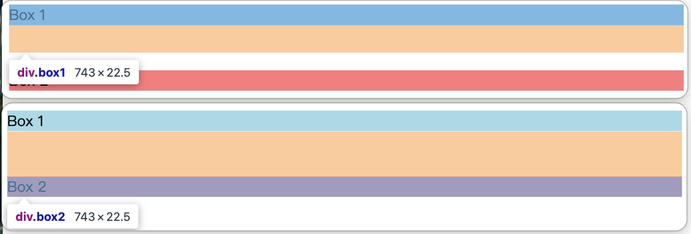
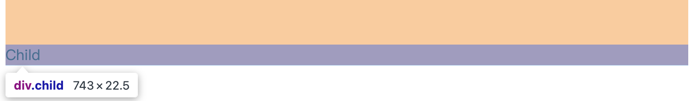
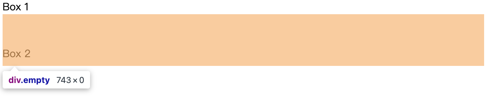

# Margin 塌陷问题
-----------

::: warning

新的 API：display: flow-root

:::

## 一、问题背景

### Q1: 什么是 Margin 塌陷（Margin Collapse）？

**A:** Margin 塌陷是 CSS 中一个经典的布局问题，指的是在某些情况下，相邻元素的垂直外边距（margin）会合并成一个外边距，而不是两者相加。这种行为常常导致意料之外的布局效果。

**核心概念：**
- 只有**垂直方向**（top 和 bottom）的 margin 会塌陷
- **水平方向**（left 和 right）的 margin 永远不会塌陷
- 塌陷后的 margin 值取两者中的**较大值**

---

## 二、发生场景

### Q2: Margin 塌陷的三种主要场景是什么？

**A:** Margin 塌陷主要发生在以下三种场景：

#### 场景 1：相邻兄弟元素的垂直 margin

**描述：**
两个上下相邻的兄弟元素，上元素的 `margin-bottom` 和下元素的 `margin-top` 会发生塌陷。

**示例代码：**
```html
<div class="box1">Box 1</div>
<div class="box2">Box 2</div>
```

```css
.box1 {
  margin-bottom: 30px;
  background: lightblue;
}

.box2 {
  margin-top: 50px;
  background: lightcoral;
}
```

**实际效果：**
- 预期间距：30px + 50px = 80px
- 实际间距：max(30px, 50px) = **50px**（发生塌陷）



---

#### 场景 2：父子元素的垂直 margin（最常见）

**描述：**
父元素与第一个/最后一个子元素之间的 margin 会发生塌陷。这是最常遇到的问题。

**示例代码：**
```html
<div class="parent">
  <div class="child">Child</div>
</div>
```

```css
.parent {
  background: lightblue;
  /* 没有 border 或 padding */
}

.child {
  margin-top: 50px;
  background: lightcoral;
}
```

**实际效果：**
- 预期效果：子元素距离父元素顶部 50px
- 实际效果：**父元素整体向下移动 50px**，子元素没有内部间距
- 原因：子元素的 `margin-top` 与父元素的 `margin-top` 塌陷了



---

#### 场景 3：空元素的上下 margin

**描述：**
如果一个元素没有内容、padding、border、height，它的 `margin-top` 和 `margin-bottom` 会塌陷成一个。

**示例代码：**
```html
<div class="box1">Box 1</div>
<div class="empty"></div>
<div class="box2">Box 2</div>
```

```css
.empty {
  margin-top: 30px;
  margin-bottom: 50px;
  /* 没有内容、高度、边框 */
}
```

**实际效果：**
- 预期：Box1 和 Box2 之间有 80px 间距
- 实际：间距为 **50px**（空元素自身的 margin 塌陷成一个）



---

## 三、解决方案对比

### 方案对比总结表

| 方案 | 实现难度 | 兼容性 | 副作用 | 适用场景 | 推荐指数 |
|------|----------|--------|--------|----------|----------|
| display: flow-root | 低 | ✅ 现代浏览器 | 无 | 父子塌陷（最佳） | ⭐⭐⭐⭐⭐ |
| overflow: hidden | 低 | ✅ 优秀 | 可能裁剪内容 | 快速修复 | ⭐⭐⭐⭐ |
| Flexbox/Grid | 低 | ✅ 现代浏览器 | 改变布局模型 | 现代项目 | ⭐⭐⭐⭐⭐ |
| padding 代替 margin | 低 | ✅ 完美 | 影响盒模型计算 | 简单场景 | ⭐⭐⭐⭐ |
| border 透明边框 | 低 | ✅ 优秀 | 占用 1px 空间 | 兼容老项目 | ⭐⭐⭐ |

---

## 四、推荐解决方案详解

### Q3: display: flow-root 方案（最推荐 ⭐⭐⭐⭐⭐）

**原理：**
- `display: flow-root` 是专门为创建 BFC（Block Formatting Context）而设计的
- BFC 内部的 margin 不会与外部发生塌陷

**代码示例：**
```css
.parent {
  display: flow-root;
  background: lightblue;
}

.child {
  margin-top: 50px;
  background: lightcoral;
}
```

**优点：**
- ✅ **语义明确**，专为此场景设计
- ✅ **无副作用**，不影响其他样式
- ✅ 实现简单，一行代码搞定
- ✅ 不改变元素的布局特性（仍是块级元素）

**缺点：**
- ⚠️ IE 浏览器不支持（现代项目可忽略）

**适用场景：**
- 父子元素 margin 塌陷
- 需要创建 BFC 的所有场景

---

### Q4: overflow: hidden 方案（简单实用 ⭐⭐⭐⭐）

**原理：**
- `overflow: hidden` 也会创建 BFC
- 阻止内部元素的 margin 与外部塌陷

**代码示例：**
```css
.parent {
  overflow: hidden;
  background: lightblue;
}

.child {
  margin-top: 50px;
  background: lightcoral;
}
```

**优点：**
- ✅ 兼容性优秀（IE6+ 都支持）
- ✅ 实现简单
- ✅ 是传统 BFC 解决方案中最常用的

**缺点：**
- ⚠️ 可能**裁剪溢出内容**（如工具提示、下拉菜单）
- ⚠️ 如果子元素需要溢出显示（如阴影、定位元素），会被隐藏

**适用场景：**
- 内容不需要溢出的容器
- 快速修复 margin 塌陷
- 需要兼容老版本浏览器

---

### Q5: Flexbox/Grid 方案（现代布局 ⭐⭐⭐⭐⭐）

**原理：**
- Flex 容器和 Grid 容器内部**不会发生 margin 塌陷**
- 这是现代布局方式的天然优势

**代码示例：**

**Flexbox：**
```css
.parent {
  display: flex;
  flex-direction: column;
  background: lightblue;
}

.child {
  margin-top: 50px;
  background: lightcoral;
}
```

**Grid：**
```css
.parent {
  display: grid;
  background: lightblue;
}

.child {
  margin-top: 50px;
  background: lightcoral;
}
```

**优点：**
- ✅ **根本上避免** margin 塌陷
- ✅ 提供强大的布局能力
- ✅ 现代项目的推荐方案
- ✅ 兼容性已经很好（IE11+ 部分支持）

**缺点：**
- ⚠️ 改变了容器的布局模型
- ⚠️ 可能影响现有的布局逻辑
- ⚠️ 需要理解 Flex/Grid 的布局规则

**适用场景：**
- 新项目或现代化改造的项目
- 本身就需要 Flex/Grid 布局的场景
- 追求最优解的开发者

---

### Q6: padding 代替 margin 方案（简单直接 ⭐⭐⭐⭐）

**原理：**
- padding 不会发生塌陷
- 用 padding 创建间距代替 margin

**代码示例：**
```css
.parent {
  padding-top: 50px;
  background: lightblue;
  box-sizing: border-box; /* 避免影响尺寸计算 */
}

.child {
  /* 不使用 margin-top */
  background: lightcoral;
}
```

**优点：**
- ✅ 最简单直接的解决方案
- ✅ 完美兼容所有浏览器
- ✅ 不会有任何塌陷问题

**缺点：**
- ⚠️ 改变了盒模型（padding 会增加元素尺寸）
- ⚠️ 背景色会延伸到 padding 区域
- ⚠️ 需要配合 `box-sizing: border-box` 使用

**适用场景：**
- 简单的父子间距问题
- 不介意背景色填充间距区域
- 需要最大兼容性的场景

---

### Q7: 透明 border 方案（兼容老项目 ⭐⭐⭐）

**原理：**
- 给父元素添加透明 border
- border 会阻止 margin 塌陷

**代码示例：**
```css
.parent {
  border-top: 1px solid transparent;
  background: lightblue;
}

.child {
  margin-top: 50px;
  background: lightcoral;
}
```

**优点：**
- ✅ 兼容性优秀
- ✅ 实现简单

**缺点：**
- ⚠️ 会占用 1px 的空间
- ⚠️ 可能影响精确的尺寸计算
- ⚠️ 语义不够清晰

**适用场景：**
- 老项目维护
- 不想改变现有布局逻辑

---

## 五、进阶面试题

### Q8: 什么是 BFC？它如何解决 margin 塌陷？

**A:**

**BFC（Block Formatting Context，块级格式化上下文）定义：**
- BFC 是 CSS 中的一个独立渲染区域
- 内部元素的布局不会影响外部元素
- 是一个隔离的容器

**BFC 的特性：**
1. 内部的 margin 不会与外部发生塌陷
2. 清除内部浮动（高度塌陷）
3. 阻止元素被浮动元素覆盖

**如何创建 BFC：**
```css
/* 方法 1：最推荐 */
display: flow-root;

/* 方法 2：传统方案 */
overflow: hidden;
overflow: auto;

/* 方法 3：定位 */
position: absolute;
position: fixed;

/* 方法 4：浮动 */
float: left;
float: right;

/* 方法 5：弹性/网格布局 */
display: flex;
display: grid;
display: inline-block;
```

---

### Q9: 相邻兄弟元素的 margin 塌陷如何处理？

**A:** 相邻兄弟的塌陷通常是**合理的设计**，但如果确实需要避免：

**方案 1：只设置单方向 margin**
```css
/* 统一使用 margin-bottom，不用 margin-top */
.element {
  margin-bottom: 20px;
}

.element:last-child {
  margin-bottom: 0;
}
```

**方案 2：使用 Flexbox/Grid gap**
```css
.container {
  display: flex;
  flex-direction: column;
  gap: 20px; /* 不会塌陷 */
}
```

**方案 3：在两者之间插入伪元素**
```css
.element1::after {
  content: '';
  display: table; /* 创建 BFC */
}
```

---

### Q10: 实际项目中如何选择解决方案？

**A:** 根据项目特点和场景选择：

#### 决策树：

```
是新项目或支持现代浏览器？
├─ 是 → 使用 Flexbox/Grid 或 display: flow-root（⭐⭐⭐⭐⭐）
└─ 否
    ├─ 需要兼容 IE？
    │   ├─ 是 → 使用 overflow: hidden 或 padding（⭐⭐⭐⭐）
    │   └─ 否 → 使用 display: flow-root（⭐⭐⭐⭐⭐）
    └─ 简单场景且不介意改用 padding？
        └─ 是 → 直接用 padding 代替 margin（⭐⭐⭐⭐）
```

**最佳实践建议：**
1. **现代项目首选**：`display: flow-root` 或 Flexbox/Grid
2. **老项目维护**：`overflow: hidden`（注意溢出内容）
3. **快速修复**：`padding` 代替 `margin`
4. **避免兄弟塌陷**：统一使用单向 margin + Flexbox `gap`

---

## 六、总结

### 核心要点

1. **Margin 塌陷只发生在垂直方向**，水平方向不会塌陷
2. **三种主要场景**：
   - 相邻兄弟元素（通常是合理的）
   - 父子元素（最常见的 bug 来源）
   - 空元素自身
3. **最佳解决方案**：
   - 现代项目：`display: flow-root` 或 Flexbox/Grid
   - 传统项目：`overflow: hidden`
   - 简单场景：`padding` 代替 `margin`

4. **理解 BFC** 是掌握 CSS 布局的关键知识点

---

## 七、扩展阅读

- [CSS Mastery: Mastering Margin Collapsing](https://developer.mozilla.org/en-US/docs/Web/CSS/CSS_Box_Model/Mastering_margin_collapsing)
- [BFC 块级格式化上下文详解](https://www.zhangxinxu.com/wordpress/2015/02/css-deep-understand-flow-bfc-column-two-auto-layout/)
- [CSS 规范：margin collapsing](https://www.w3.org/TR/CSS2/box.html#collapsing-margins)

