

# 珍惜时光，记忆童年

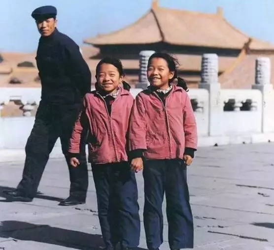

时光一去不复返，珍惜眼前，珍惜当下！

我们的小时候，没有手机，没有电脑，没有网络，却依然玩得很开心。

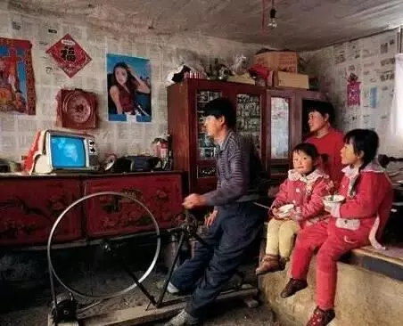

## 翻花绳

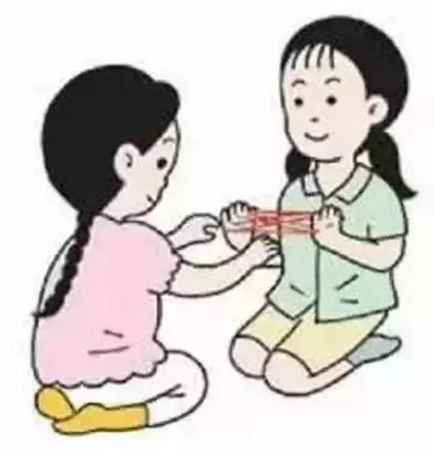

用手指简单比划两下，就可以翻转出许多的花样：金鱼、钱包、各种网状、一朵花...很神奇有木有！

## 跳皮筋

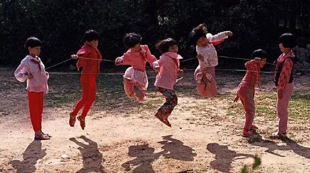

女孩子的最爱，一放学就像脱缰的野马，跳到天黑也不舍得回家。

## 抓石子儿

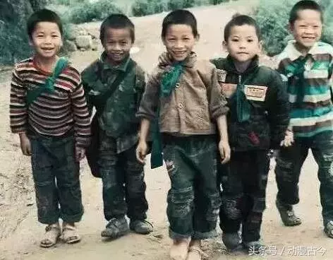

小伙伴们席地而坐，先抛一个石子，再抛两个……眼睛和脖子，不停地随石子的抛上落下摆动。

## 拍纸片

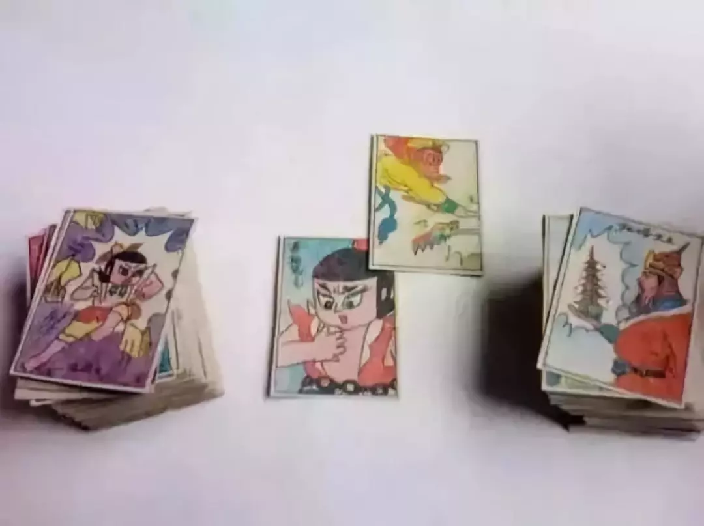

谁拍得翻过来了，就可以得到对方的"画片"，就算手拍疼了、拍红了，也不在乎。

## 跳房子

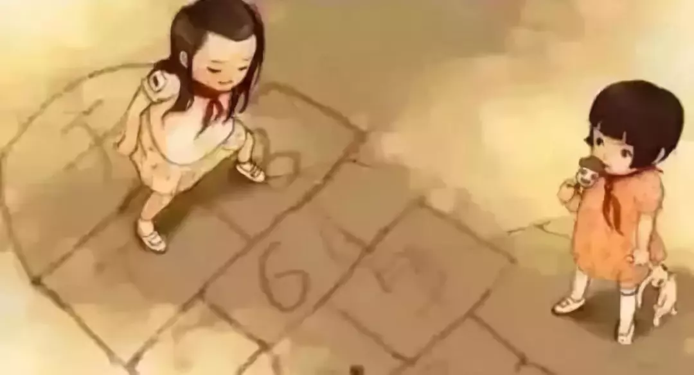

在地上画个"房子"，单腿双腿跳一下午都不累。

## 弹玻璃珠

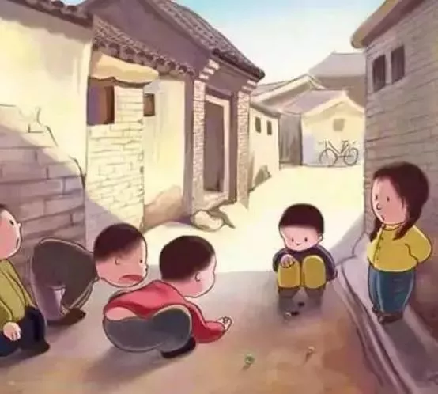

玻璃球撞来撞去，最受男孩子们的喜爱。

## 丢沙包

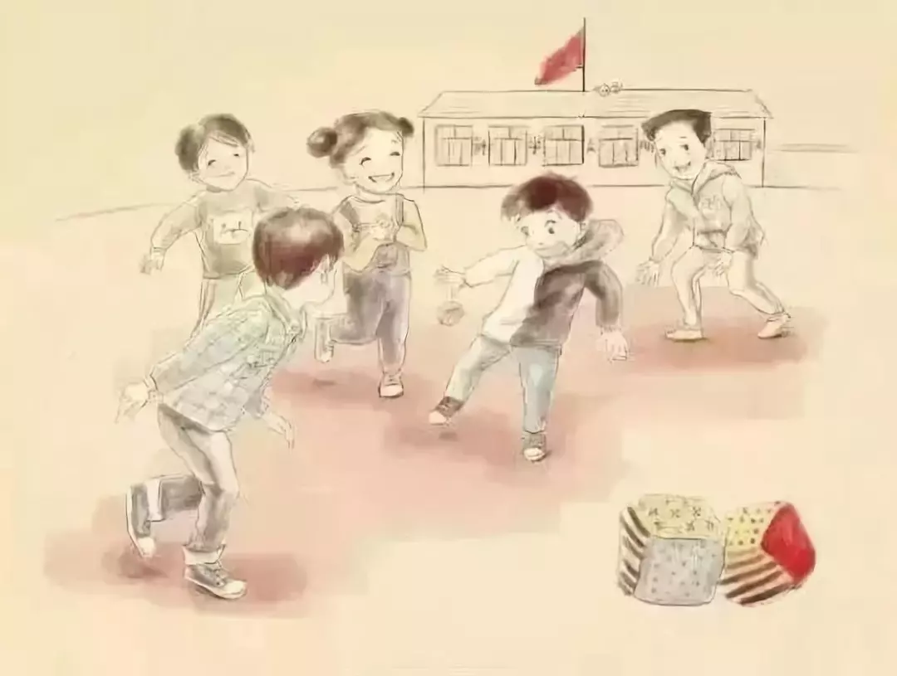

自己用碎布、针线缝成，用细沙塞满的沙包，就是我们的强有力武器。

## 瞎子摸人

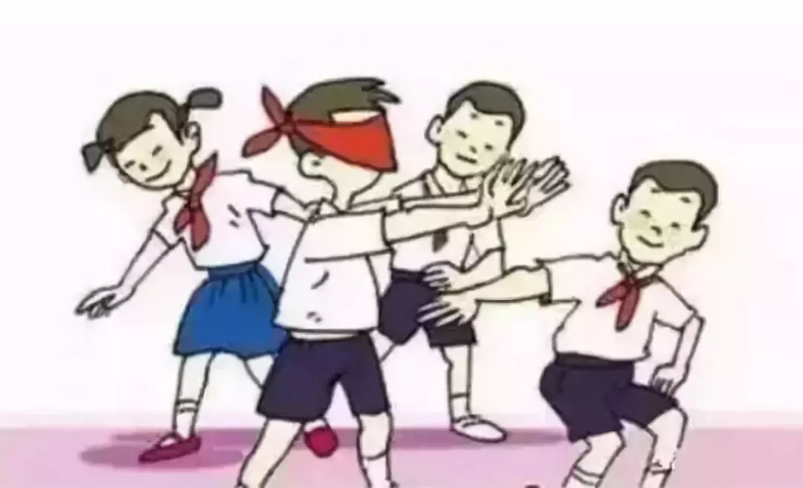

"来抓我啊，抓我啊..."

## 斗鸡

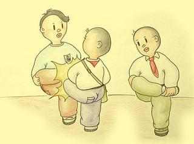

咳咳，这可以说是最"礼貌"的比武方式了，单腿膝盖就能决出胜负。

## 跳山羊

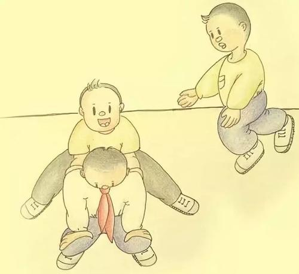

简单粗暴，卯足劲，一二三，跳！

## 老鹰抓小鸡

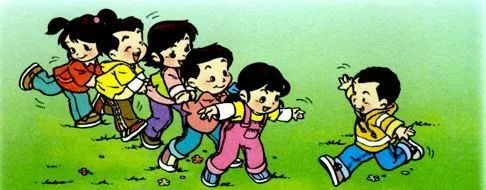

"小鸡们"吓得左躲右闪，尖叫声从头到尾都不断，"啊、啊，快跑！"

## 捉迷藏

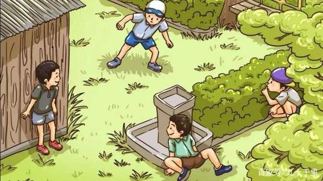

想尽一切办法，找到藏身的地方，心里默默窃喜：你肯定找不到我的~

## 木头人

不、敢、动，甚至，不、敢、呼、吸...

## 钓鱼

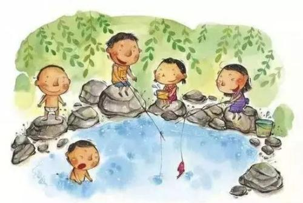

一根竹竿，一个两毛钱的鱼线，蚯蚓自己挖，再带个塑料桶，一钓就是半天。

## 摘野果

每天爬上爬下，田间飞跑，捉虫子，采花，上山摘野果。

## 东西南北

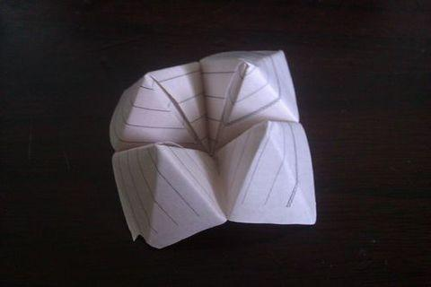

小时候老和几个小朋友一起玩，现在你还会折吗？

## 抄歌词

手抄歌词本，一字、一句写下来，每一本都写得满满当当的。

## 小人书

花几分钱，租小人书，坐在小板凳上，津津有味一看就是个把小时。

## 那些年的记忆

这是我们一生中最快乐的时光，那些无忧无虑的日子，还恍如昨日，记忆犹新。

### 那年

我们没有电脑和WiFi，书包还没有那么重，小伙伴一起围在黑白电视前，看西游记、黑猫警长、葫芦娃...

### 那年

我们没有冰箱，炎炎夏日，吃着几毛钱的冰棒，或是自家种的西瓜，嘴里凉丝丝，心里甜滋滋。

### 那年

我们很难看到汽车，大家骑着自行车玩耍，三三两两，你追我赶，在大马路上撒了欢儿地"狂飙"。

### 那年

我们没有钱，三五成群嬉戏游玩，一根绳子，几块石头，就可以玩得酣畅淋漓。

## 感悟

几十年前，我们什么都没有，漫山遍野四处跑，但我们不觉得苦，我们记住的只有快乐。

现在的小孩子，虽然人手一个iPad，手机玩得比我们还溜，但他们的童趣、笑声也少了很多。

我们是幸运的一代，小小年纪就拥有了全世界！

**时光一去不复返，珍惜眼前，珍惜当下！**

