

# 二十年前的今天，像极了此时此刻

## 序言：跨越千禧年的期待

20多年前的今天，像极了此时此刻。

大家刚刚熬过了艰难的一年，送走了战火、危机和离别，传说中1999年12月31日的末日并没有到来，人人都期待着一个崭新的开始。

2000年1月1日那天，《南方周末》新年贺词里说：

> "为了欢呼新世纪的太阳照临地球，全世界的人们都在翘首以待……千年等一回，为什么不呢？"

就这样，在无比热切地期待中，2000年终于来到了，许多故事从此开始了。

## 01 崭新的开始

正如人们所憧憬的那样，2000年的一切确实是崭新的样子。

连续办了21年的春晚，适应潮流打出了"推新"的招牌，足足动员了20多位主持人，还邀请了众多的港台艺人，黎明、谢霆锋、林心如赫然在列。

### 章子怡的国际之路

第一个登场亮相的艺人，是**章子怡**。

那一年，章子怡21岁，首次登台春晚，青涩的脸上写满了高兴。

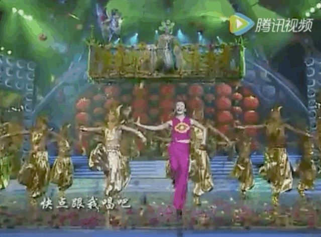

她刚刚结束了人生中第三部电影的拍摄，合作的导演从张艺谋换成了李安。

那是一部与武侠有关的电影，需要大量的动作戏。章子怡戏份不少，身上常常青一块紫一块，最严重的一次，手上指甲都被掀飞。妈妈去片场看她，心疼得差点哭了。章子怡反而笑着安慰妈妈，"拍电影总是要吃点苦头的。"

好在，这部让章子怡豁出命拍摄的电影没有辜负她。凭借这部电影，章子怡获得了无数国内和国际的大奖，一跃成为了"国际章"。

电影的名字，叫**《卧虎藏龙》**，那是中国第一部获得奥斯卡金像奖最佳外语片的电影。

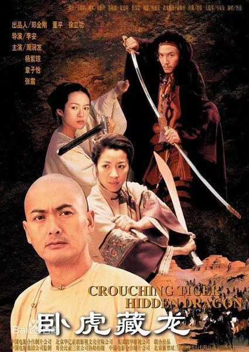

### 朴树的坚持

与章子怡的兴奋不同，第一次登上春晚的**朴树**，从头到尾丧着一张脸，和喜悦的氛围格格不入。

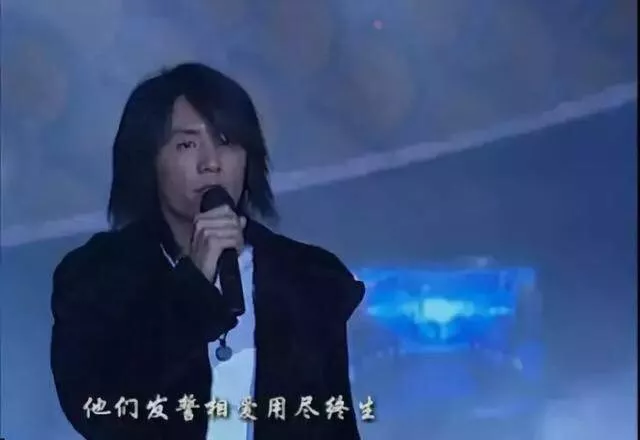

春晚开始前几天，他因为拒绝假唱和导演组闹了矛盾，一气之下拂袖而去。经纪人气得打电话骂他："你是想要毁了所有人吗？！"

朴树想了想，最终还是妥协了。那是他第一次妥协，也是他最后一次妥协。从那之后，他终于坦然地和世界格格不入了。

朴树在春晚演唱的歌叫**《白桦林》**，出自他的首张专辑《我去2000》。那张专辑在1999年问世，写的全是对新世纪千禧年的期待。里面的很多歌，当时只觉得好听，20年后才听懂。

制作专辑的时候，朴树非常反对将《白桦林》这首歌放进专辑里。有位好友反复劝他，"哪怕不放在专辑a面，也要放在b面，千万不要丢下了。"

这位能劝动朴树的好友，叫**高晓松**。

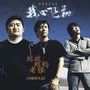

### 爱情的模样

那时候，高晓松还不叫"矮大紧"，更不是人生导师。他筹备了一部电影处女作，叫**《那时花开》**。

电影风格大胆，再加上拍摄手法生疏，喜欢的人并不多。人们津津乐道的，其实是这部电影的两位主角，**朴树和周迅**。

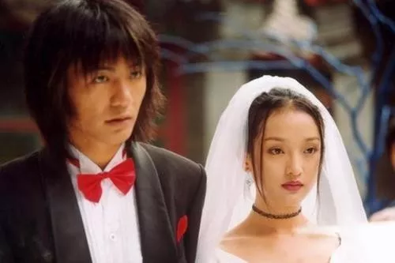

因为这部电影，朴树和周迅陷入热恋。片场里，两个人像连体婴一样，一刻都不愿分开。一个在车里睡觉，一个就呆呆在车外守着。

那一年，朴树27岁，周迅26岁。一切都还正年轻。

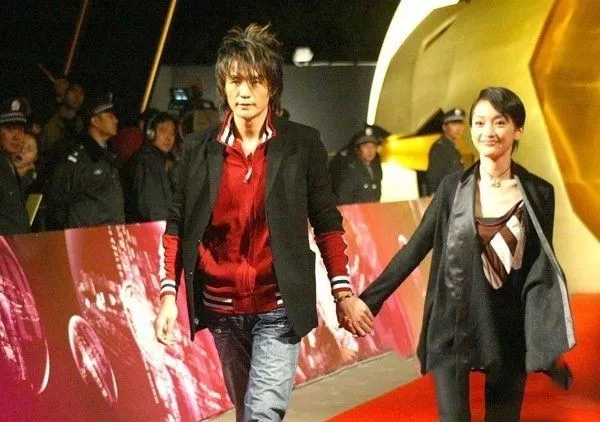

高晓松在电影里，表达的都是如风的岁月，不凡的人生，滚滚红尘，遗世独立。

14年后，周迅另嫁他人，朴树也结婚多年，高晓松再一次重提往事，只剩下老气横秋的感慨：

> "如今我们老了，平凡得如同路边的树木。虽然不再呼喊奔跑，却默默生出许多根，记住许多事，刻下年轮,结出果实。"

二十年恍如隔日，不管我们愿不愿意，都早已告别了当初的自己。

## 02 传奇的起航

2000年，注定是一个传奇的时间点。很多传奇，从这一年起航。

### 女团时代的序章

有三个女孩，共同参加了一个名叫**《宇宙2000实力美少女争霸战》**的比赛。

她们各有各的原因：有的是因为妹妹年龄太小，想要替妹妹实现梦想；有的是想赢得一万元奖金；有的是希望赚钱给家里买沙发。

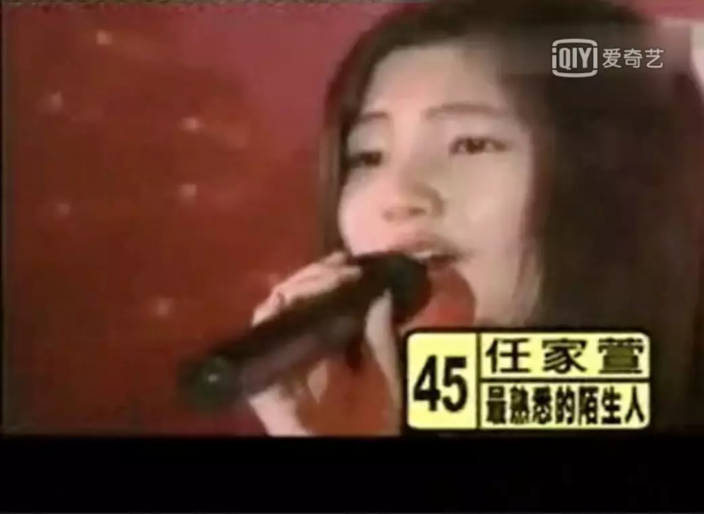

在公司的撮合之下，她们没有分头出道，而是组成了组合，组合的名字叫**S.H.E**。

第一次听到这个名字，她们的第一反应是："完了,肯定不会红的。"

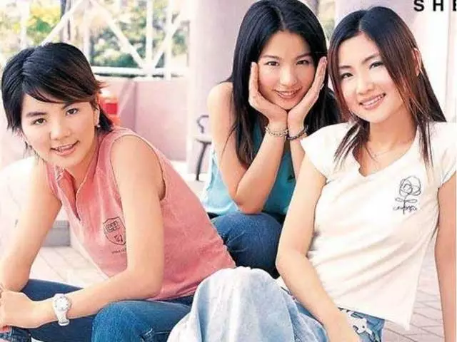

另一边的香港，也有两个女孩相遇了。一个叫钟欣潼，一个叫蔡卓妍，她们签约了鼎鼎有名的英皇娱乐，正向着自己的明星梦努力。

第二年，她们组成了一个名叫**Twins**的组合，在舞台上唱，"最后变天后，变新娘，都是理想。"

### 华语乐坛的黄金时代

另一边，21岁的青年**周杰伦**已经为了自己的梦想努力了很久。

他前后写了许多歌，给过刘德华和张惠妹，均被拒绝。吴宗宪告诉他，如果你能十天写出50首歌，我就帮你出专辑。

周杰伦听罢，去买了一箱泡面，泡在工作室里整整十天，完完整整写了50首歌。

2000年，周杰伦拥有了人生中第一张专辑**《JAY》**，正式出道，一鸣惊人。

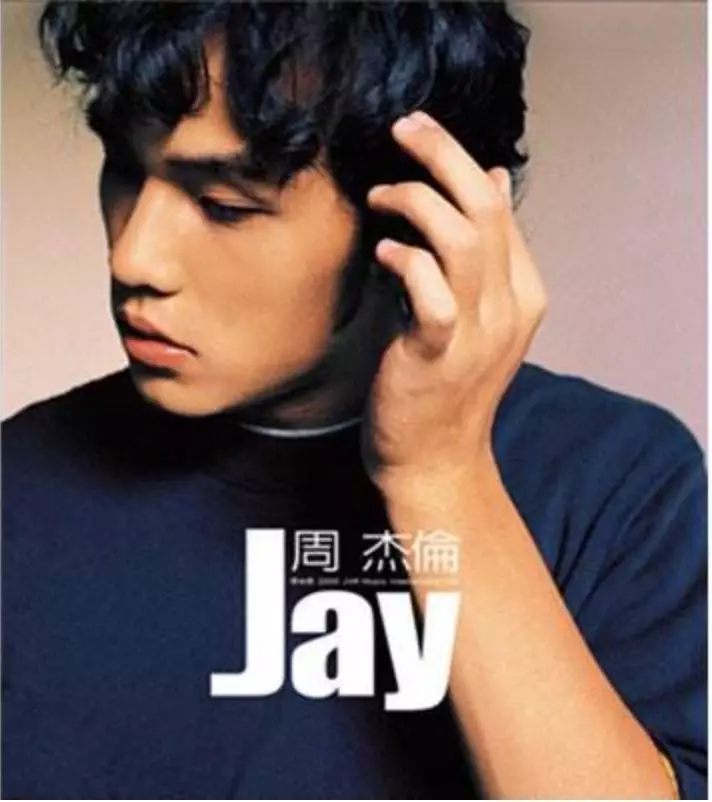

据说，那时候的男孩向女孩表白，都会放同一首旋律："手牵手，一步两步三步四步望着天；看星星，一颗两颗三颗四颗连成线。"

然而，哪怕出道专辑如此惊艳，周杰伦并没有获得那年的最佳新人奖。

"抢走"新人奖的，是一位来自新加坡的女歌手，叫**孙燕姿**。她赢过周杰伦的那首歌，叫做**《天黑黑》**。

她有标志性的唱腔，笑起来有两个小酒窝，总是一副温婉大气的模样。

19年后，她成了两个孩子的妈妈，在选秀节目里当评委。因为听到选手的一句"喜欢你多年"，便哭了很久。

2000年最火的女歌手，叫**梁静茹**。那句"爱真的需要勇气，去面对流言蜚语"，给了无数向往爱情的少女鼓励。

后来，人们评价她，唱透了爱情里的悲欢离合。再后来，我们知道，唱透爱情与败给婚姻，两者并不矛盾。

### 音乐的温度

2000年，人们并不习惯在网上听歌，路边开满了音像店，为了抢喜欢的专辑，要起个大早、甚至逃课去排队。

我们要攒很久的钱，去买一张CD或一盘磁带。很多女孩，会用五颜六色的笔，把歌词一句一句抄在本子上。

那时候，热门歌曲排行榜上的歌，几乎每一首都会哼唱。

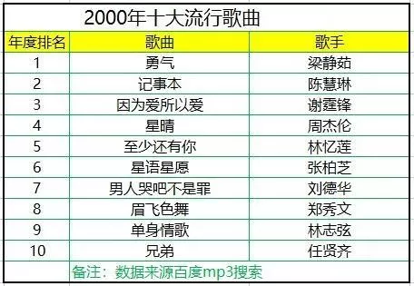

曾以为，那是华语流行音乐的开始，如今才发现，那已经是华语流行音乐最好的时候了。

---

## 03 互联网的萌芽

作为21世纪的第一年，人们对2000赋予了太多期待：离开的朋友重新回来，梦中的恋人突然出现，世界上所有的好运，都会随着千禧年如约而至。

### 百度的诞生

有一位名叫**李彦宏**的青年，特地从美国回国，希望借着千禧年的东风，能够收获好运气。

他带着一笔120万美元的风险投资，窝在北大资源宾馆的房间里，脑子里循环浮现刚刚看过的一句词，"众里寻他千百度……"

于是，全球最大的中文搜索引擎**百度**，应运而生。

### 电商的开端

另一边的**当当网**运气也很好，成功拿到了第一笔风险投资。

俞渝和李国庆，这对商界夫妻意气风发，一手婚姻一手事业，是所有人羡慕的神仙眷侣。

俞渝公开夸赞老公："没有我俞渝，还是会有当当；但是没有李国庆，就一定不会有当当。"

她怎么都不会想到，20年过去，自己会为了守住艰苦创办的当当，不惜撕烂前夫李国庆的脸。

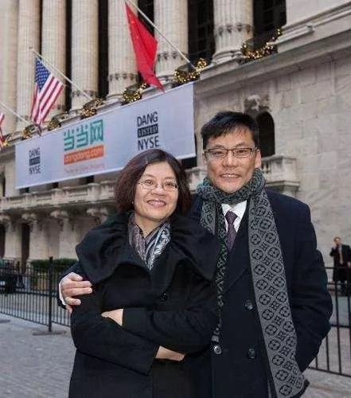

### 马云的转机

百度和当当网顺风顺水，**阿里巴巴**可就没这么幸运了。

马云东拼西走的50万创业基金，还没怎么用就所剩无几。无路可走的他只得四处拉投资，但均被拒绝。其中就包括雷军。

雷军第一次见到马云，只觉得对方鼠头贼脑，满嘴不切实际的想象，怎么看怎么不靠谱，毫不犹豫就拒绝了。

然而，"不切实际"的马云没能吸引雷军，却吸引了**孙正义**。他被马云的激情和自信所打动，大手一挥就投了4000万美元。这4000万，不仅帮助马云躲过账面危机，也帮助阿里巴巴熬过了接下来的互联网寒冬。

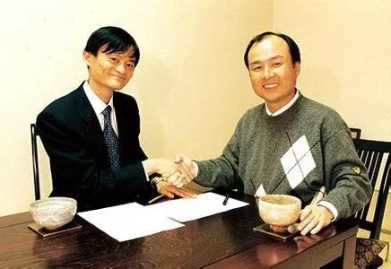

**生活就是这样，有的人讨厌你，就会有人欣赏你。它让你放弃和等待，也许是为了给你更好的。**

### 梦想的转向

26岁的**黄渤**，为了音乐梦想北漂多年，得到的评价不是"有点丑"，就是"实在丑"，差一点就想打包回山东老家。

这一年，黄渤被引荐拍摄了人生的第一部电影**《上车，走吧》**。电影拍摄只用了12天，却拿到了金鸡奖第一次设立的最佳电视电影奖。

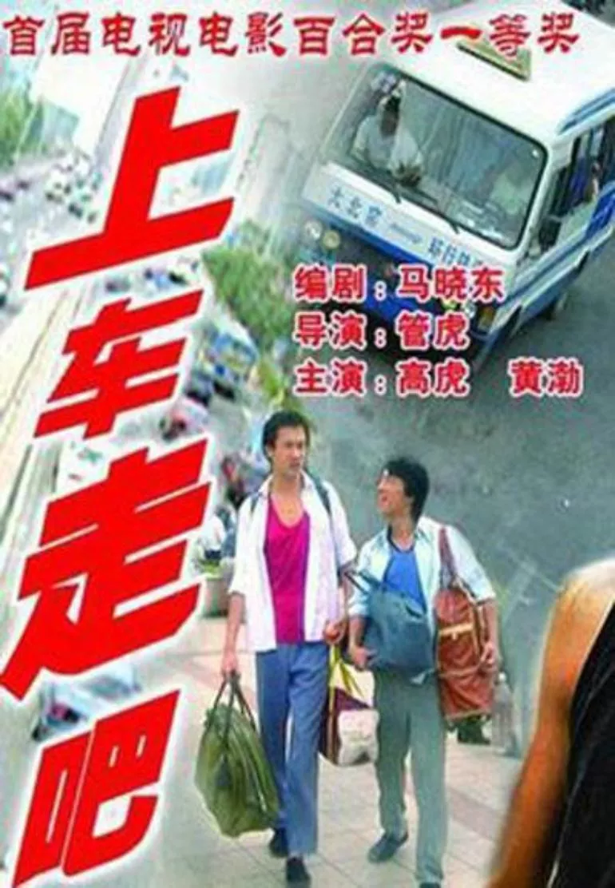

颁奖那天，黄渤坐在嘉宾席上，身边是无数只能在电视里看到的明星大腕，他不觉得高兴，只觉得别扭："过去十年的歌唱事业，到底算什么？"

一语成谶，46岁的黄渤仍未实现音乐梦想，却成了百亿影帝。

### 韩寒的叛逆

此时此刻，松江二中有一个名叫**韩寒**的少年，吵着嚷着跟老师提出要退学。

老师不解："你退学以后，要靠什么生活呢？"

韩寒理所当然地答："稿费啊。"

话音未落，班里一片嘲笑声。

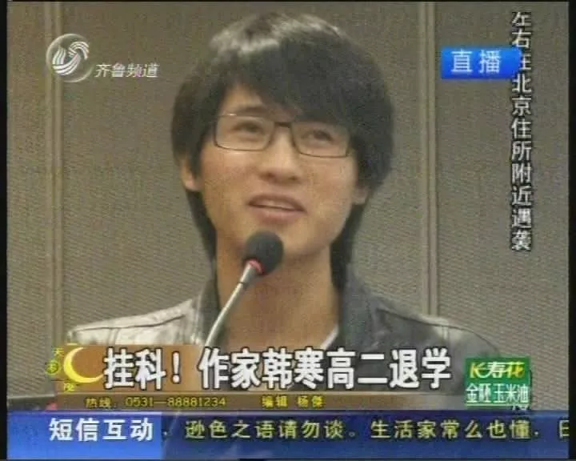

### 水木年华的诞生

2000年的北京，还有一名失意的网络工程师。

他叫**李健**，是清华毕业的名牌大学生，工作听上去也不错，可他并不开心。

新年的某一天，他接到了一个清华校友的电话："李健，你还想不想唱歌啊？"

李健一听，当机立断辞去工作，与这位名叫卢庚戌的校友一起，组成了歌唱组合**水木年华**。

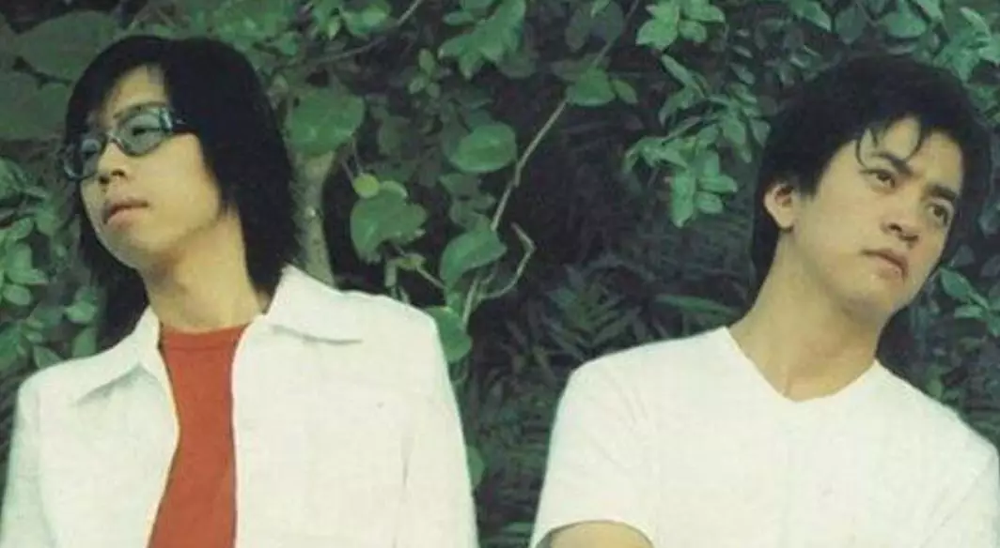

水木年华推出的第一张专辑就红了，主打歌叫做**《一生有你》**。他们一边捧着吉他，一边轻声唱：

> "多少人曾爱慕你年轻时的容颜，可知谁愿承受岁月无情的变迁，多少人曾在你生命中来了又还，可知一生有你我都陪在你身边……"

### 奥运的荣耀

水木年华唱着歌的时候，全中国都在关切着一件大事。2000年**悉尼奥运会**，开始了。

**伏明霞**顶住压力，战胜了自己的队友，成功卫冕女子单人三米板冠军。她击败的那位小将，叫郭晋晶。往后十年，人们叫她跳水女皇。

**孔令辉**在乒乓球决赛中，战胜了宿敌瓦尔德内尔，将乒乓球金牌再一次留在中国。那一届的铜牌得主，是他的队友刘国梁。往后十五年，这个"不懂球的胖子"成了总教练。

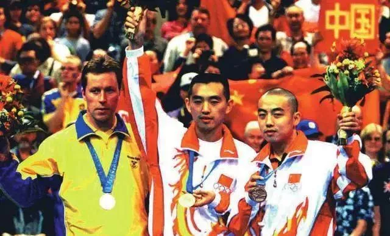

**时间是个好东西，见证了岁月，也验证了人心。不管得到还是失去，不论放弃还是等待，等以后回过头看，也许一切都是最好的安排。**

---

## 04 有些故事正在结束

2000年的世界，有些故事刚刚开始，有些故事却正在结束。

### 迈克尔·杰克逊的最后专辑

美国的流行天王**迈克尔·杰克逊**，在新年伊始获封"千禧年艺人奖"，但他并没有心情庆祝。

他刚刚结束一段婚姻，又因为各种事情饱受争议。迈克尔·杰克逊一心扑在专辑**《万夫莫敌》**上，渴望音乐带给自己一丝宁静。

很久以后人们才知道，那是他人生中最后一张制作专辑。

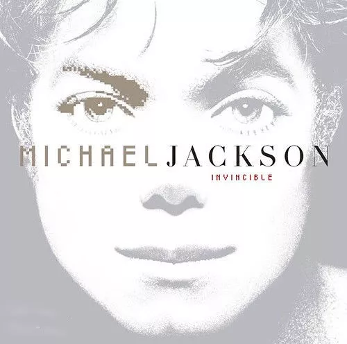

### 张国荣的独白

此时此刻的香港，**张国荣**正忙着开展自己的"热·情演唱会"。

演唱会的压轴环节，张国荣站在舞台上，只留下一盏射灯，低声念白：

> "I am what I am，我就是我，不一样的烟火。"

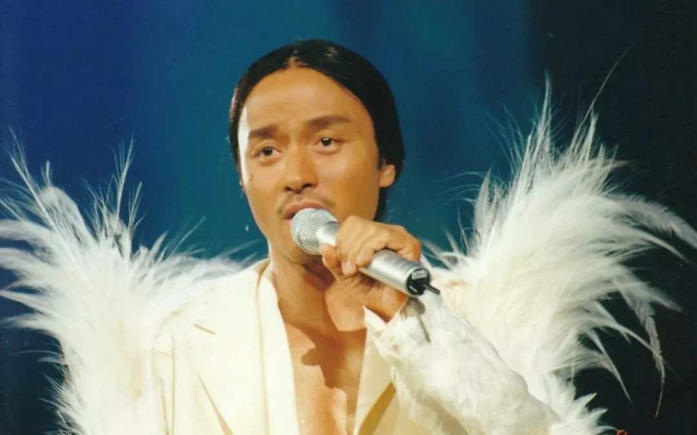

二十年过去了，我们再也没有拥有过那样的艺人，也再也没有看过那样的演唱会。

### 还珠格格的传奇

2000年，是电视剧**《还珠格格》**爆红的第二年。这一年，赵薇、林心如受邀参加春晚，红遍东南亚。

也是这一年，范冰冰因为闹解约，差一点被华谊封杀。

还是这一年，在《还珠格格2》中饰演香妃爆红的女演员**刘丹**因车祸去世，从此世间再无香妃。

同一部电视剧，同样的年份，不同的人生。大家都是各自下雪，各有各的隐晦与皎洁。

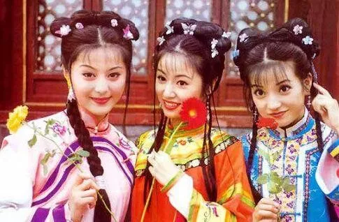

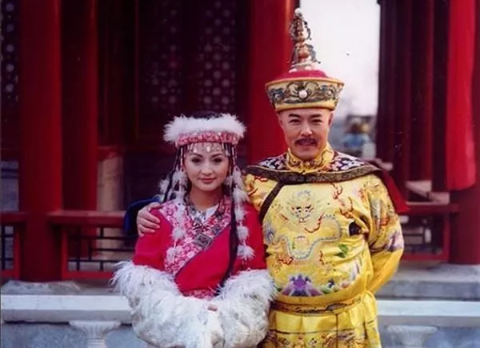

### 老友记的婚礼

大洋彼岸的另一端，也有一部家喻户晓的电视剧，讲的是6个都市青年男女的故事，名字叫**《老友记》**。

电视剧里饰演瑞秋的**珍妮佛·安妮斯顿**，在这一年与布拉德·皮特结婚。

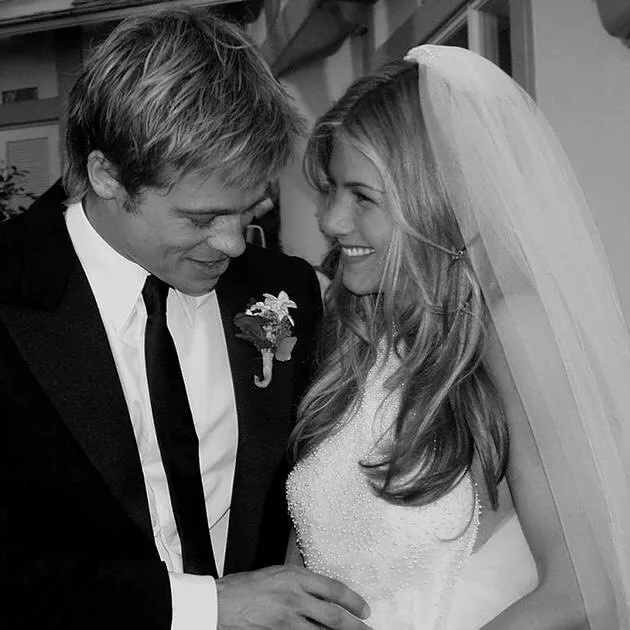

后来，布拉德·皮特在拍摄电影《史密斯夫妇》时移情别恋，婚后出轨，两个人最终分道扬镳。那个曾经让安妮斯顿期待过明天的男人，再也没有出现在她的明天里。但还好，她身边还有一群老朋友。

### 猪八戒的爱情

这一年，电视剧**《春光灿烂猪八戒》**播出了。

正当人们为电视剧里猪哥哥与龙妹妹的爱情故事流泪的时候，现实里**徐峥和陶虹**因戏生情，三年之后，两人结婚。

如今，陶虹很少拍戏，徐峥倒是成了大导演，人们见到他想到的是"药神"，是影帝，是拍啥红啥的大导演。"猪八戒"三个字，除了徐峥自己，已经很少有人提了。

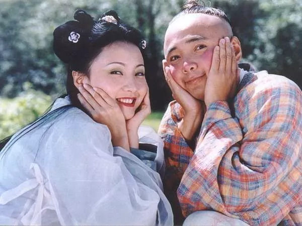

### 离别的哀伤

2000年，人们送走了说着"探戈就是探啊探着走"的小品演员**赵丽蓉**，唱着**《立秋》**的歌手**筠子**……

筠子当时的男朋友**汪峰**，为她写了一段墓志铭，里面有句话是：

> "她是个美丽世界的孤儿，太早地回到了纯真的天国，而我们还在这里。"

如今，我们也仍在这里，明白了悲欢离合，看懂了物是人非。

**我们早已明白，所有回不去的日子都有它的道理，所有回不来的人，也自有他的原因。**

## 05 岁月埋下的彩蛋

当然，不是所有2000年的故事，都有开始和结局。20年前岁月埋下的彩蛋，要等到20年后的今天才看懂。

### 花样年华

那一年，**王家卫**拍了一部电影，叫**《花样年华》**，主演是梁朝伟和张曼玉。

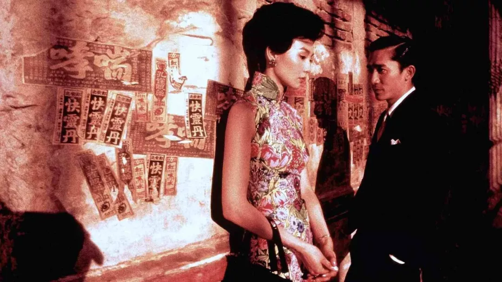

那部戏足足拍了15个月，梁朝伟和张曼玉朝夕相处了15个月。观众们和演员们一起入戏，说他们俩才是最般配的情侣。

可是，梁朝伟的身边已经有了相恋13年的正牌女友**刘嘉玲**。而且直到现在，陪在梁朝伟身边的，还是刘嘉玲。

20年前，人们不解：为什么文艺的梁朝伟，不选择同样文艺的张曼玉，偏偏选了俗气的刘嘉玲？

20年后，看客们都释怀了：**喜不喜欢、适不适合、能不能在一起，其实是完全不同的三件事。**

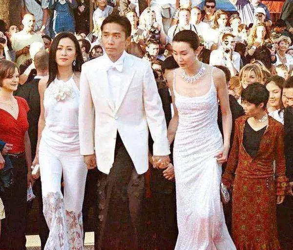

### 王菲与谢霆锋

在《花样年华》的庆功宴上，**王菲**牵着**谢霆锋**离开，正式宣布了恋情。

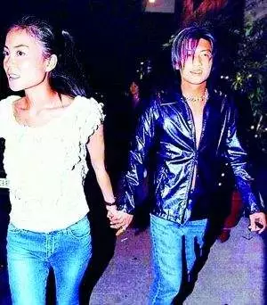

几年后，两人分手；又过几年，两人各自婚配；再过几年，两人复合。

兜兜转转二十年，陪在身边的到底还是爱得最深的。他若真的爱你，自会来找你。

**感情从来都是这样，上天不给的，无论怎样十指紧扣，仍然会走漏；上天给你的，无论如何失手，都会拥有。**

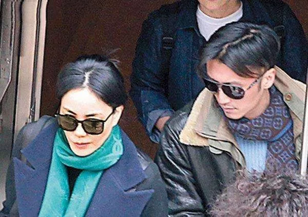

### 永远年轻

1999年，朴树为即将到来的千禧年写了一首歌，名叫**《New Boy》**。

他在歌里唱，"我看见到处是阳光，快乐在城市上空飘扬，新世界来的像梦一样，让我暖洋洋。"

二十年后，年轻乐队在节目里重新翻唱，作为嘉宾的制作人**张亚东**听得泪流满面。

他说："那个时候我们都以为世界会变得很美，结果二十年过去了，好吧，只是我们都老了。"

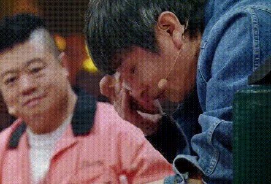

但很少有人知道，朴树曾经为这首歌重新填词，取名为**《Forever Young》**。

这一次的歌词，变成了：

> "Just那么年少，还那么骄傲，两眼带刀，不肯求饶。"

曾以为走不出去的日子，如今都回不去了。

岁月是把杀猪刀，从来不会饶过任何人。但仍然有人，**永远年轻，永远热泪盈眶**。

## 06 写给未来的自己

第一次接触到2020，是在政治课本上，"2020年全面建成小康社会"，是某一单元的必背考点。

那时候我正年少，咬着铅笔，在本子上一笔一画写下20年后的自己。

我撑着脑袋，在纸上肆意幻想：20年后能用手机打电话，家里有机器人，天上有汽车在飞。

那是我们一生的黄金时代，对未来有着许多奢望与幻想，以为日子总是很长很慢，生命中永远没有离别。

### 时光的答案

如今，幻想中的2020年已经到来，你当年的梦想和期待都实现了吗？那些以为永远不会分开的人，是否还陪在你的身边？还是已经杳无音讯？

曾觉得，时间是最可怕的东西，让我们不断变老，又不断失去。

如今惊觉，**时间其实是最宝贵的力量，你现在的生活，取决于之前的选择；而现在的选择，决定了未来的生活。**

人生这场游戏的最终结局，恰恰是遗憾和圆满加起来的总和。是20年前的你，塑造了20年后的你。

### 写给幸福

席慕容在**《写给幸福》**写过这样一段话：

> 在年轻的时候，在那些充满了阳光的长长的下午，我无所事事，也无所惧怕，只因为我知道，在我的生命里有一种永远的等待。挫折会来，也会过去，热泪会流下，也会收起。没有什么可以让我气馁，因为，我有着长长的一生。

**时间，永远是生活最好的答案。**

不论过去遭遇过什么，不妨多给自己一点点时间，我们一起等等看到底会发生什么。

### 下一个二十年

2020年开始了，意味着人生又一个崭新的20年也开始了。我们接下来的选择与付出，或许才是这一生真正的注解。

人生能有几个二十年？重要的岔路口就那么几个。即使我们无法改变整个世界，但至少我们可以努力做好自己。

**愿你的过往悲欢，点亮崭新的向往；愿你的下一个20年，一切会更好。**

## 后记

当我们回望2000年，会发现那是一个充满希望与梦想的时代。那时的我们相信，只要努力，一切皆有可能。

20年过去了，有些梦想实现了，有些梦想破碎了。但无论如何，那段岁月都是我们生命中最珍贵的记忆。

如今站在2026年回望，我们又将如何书写下一个20年的故事呢？

也许答案就藏在每一个平凡的日子里，藏在每一次选择和坚持中。

**珍惜当下，不负韶华。因为今天的我们，正在创造着20年后的回忆。**

