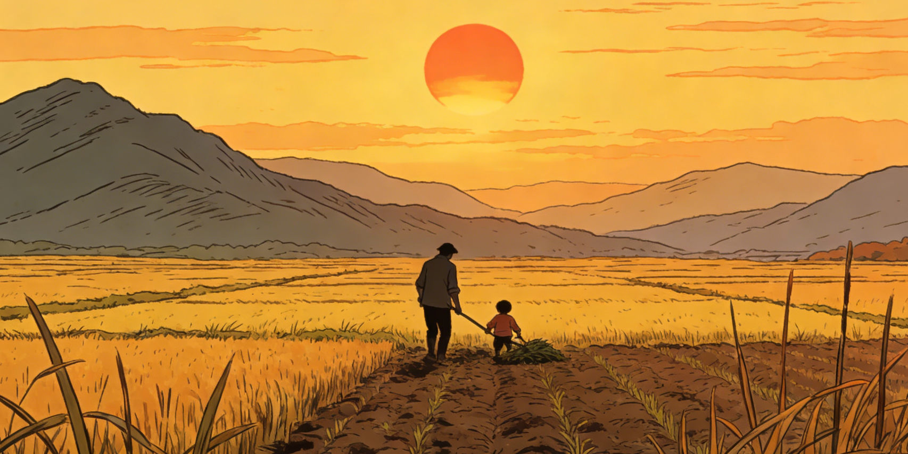

# 山的那边

---

黎明咬破夜的唇,将那抹血迹留于天际。于是,鸡鸣,犬吠,炊烟袅袅地从寨子里浮起来了,飘飘摇摇进了林子。

父子俩便起了床,父亲用麻利的手脚,戴上斗笠,荷上锄头,"吱———"地打开门,走去。儿子的动作显得嫩生了许多。摸下床,掬了一捧清水,清醒了自己,水缸中一圈一圈漾着他惺忪的睡眼。然后拎起灶上昨夜整好的干粮,朝着渺茫的晨雾中那个略有些佝偻的身影奔去……

这是一方好美的水土。是啊,来这里拍照旅游的人都这么说。绿水环抱着青山,相环相绕,相厮相守,美了这里的风景,也美了这里的人。只是光着脚的儿子不懂,为何如此迷人的风景,留不住那张记忆深处母亲模糊的脸,让爹和自己成日守着那块巴掌大的地,还让自己光着脚丫子满山溜。只是这些疑问,似乎都没有个清晰的答案,儿子疑惑,山水也疑惑了。

那块巴掌大的地,便是当地人称作"坝子"的山间小盆地。不大,却隐着儿子童年所有的欢娱,锄草、浇水、施肥,甚至是看着太阳从山的那边落下。而此刻,儿子和父亲正躬着背,劳作。

儿子累了,直起腰来。"爹,俺还得在这里多久?"

父亲一怔,"说啥?伢子。"

"爹,俺老师说让俺回学校上课……"父亲没回话,双眉稍稍蹙了一下。

"爹,老师说了,上了学,有了学问,就能出山。山的那边可大了!老师说出了山,就能让视野变大———"

"啥,'视野'不'视野'的?俺只懂种地!"

儿子不还嘴了。他懂爹的脾气。只是他用稚嫩的眼,瞅了瞅银雾弥漫的青山,又低下头劳作。

而爹也纳闷了。"山的那边,真有'视野'么?说不准有,要不他妈为啥死活不肯回来?———不想咯,不想咯。"

正午,山雾便揭开了面纱,山才笔挺地屹于水中,父子俩歇下来,坐在田埂上。父亲黝黑的脸上沾满汗水,手一抹,便又沾上些泥的芳香。

儿子又呆了,望着山的那边。

"伢子,又怔!快吃,干活。"儿子收回眼神,有些失落。于是,又是劳作。

红日西薄。天际再次被染红,不过,是金灿灿的,烘得儿子的心暖暖的。

儿子眯缝起眼,似乎在眺望着什么,脸颊红彤彤的,又有话要说,"爹,瞧!"

爹也直起身子。

"爹,看。太阳落到山的那边去了。那里肯定遍地都是金子。太阳也喜欢那边。"

爹倏然有了欲哭的念头。是呀!说不准伢子出了山,能找回他娘呢!想到这里,心里不禁幻想出他娘回来的情景,心里也就暖了。

"伢子,上学去吧!爹许了。"儿子脸上真的暖了。他能回学校了,能有"视野"了。

"记得给老师捎句话,让他记得给你们'视野'……"

山和水找到答案了,灵动在父子的心里……

---

## 赏析

### 开篇意象

**"黎明咬破夜的唇,将那抹血迹留于天际"**

文章开篇便用诗意的语言描绘了黎明时分的景象。拟人化的手法赋予了黎明和黑夜生命,将天边的朝霞比作"血迹",既写出了色彩,又暗示了生活的艰辛。

### 人物刻画

#### 父亲
- 麻利的手脚,佝偻的身影 - 常年劳作的农民形象
- "俺只懂种地" - 朴实、固守传统
- 最后同意儿子上学 - 父爱的觉醒与改变

#### 儿子
- 稚嫩、憧憬外面的世界
- "视野"成为他心中的向往
- 对母亲的思念,对知识的渴望

#### 母亲
- 虽未正面出现,但始终是情节的重要线索
- "记忆深处模糊的脸" - 已经离开去了山外
- 暗示了山外世界的吸引力

### 主题思想

#### 1. 教育改变命运
文章通过儿子对"视野"的向往,表达了知识改变命运的主题。上学,走出大山,成为山里孩子的梦想。

#### 2. 父爱的深沉
父亲从反对到同意,体现了深沉的父爱。他希望儿子能走出大山,甚至幻想"说不准伢子出了山,能找回他娘呢"。

#### 3. 城乡差距
"绿水环抱着青山"的美景,却留不住人。外面世界的诱惑与山里生活的贫困形成对比。

### 艺术特色

#### 1. 诗意化的语言
- "黎明咬破夜的唇"
- "炊烟袅袅地从寨子里浮起来"
- "太阳落到山的那边去了,那里肯定遍地都是金子"

#### 2. 细节描写生动
- "水缸中一圈一圈漾着他惺忪的睡眼"
- "父亲黝黑的脸上沾满汗水,手一抹,便又沾上些泥的芳香"

#### 3. 对比手法
- 山里的美景 vs 生活的贫困
- 父亲的固守 vs 儿子的向往
- 现在的困境 vs 未来的希望

#### 4. 象征意义
- **山** - 阻隔、贫穷、闭塞
- **山的那边** - 希望、知识、未来
- **视野** - 眼界、机会、改变

### 情节发展

1. **黎明劳作** - 展现日常生活
2. **田间对话** - 矛盾冲突显现
3. **父亲的纠结** - 对妻子离开的思索
4. **日落感悟** - 情感的转变
5. **同意上学** - 希望的升华

### 社会意义

这篇文章反映了中国农村地区的现实问题:

1. **留守问题** - 母亲外出,父子留守
2. **教育观念** - 从"只懂种地"到认同读书
3. **代际冲突** - 传统观念与新思想的碰撞
4. **脱贫之路** - 教育成为走出贫困的希望

### 结尾的意蕴

**"山和水找到答案了,灵动在父子的心里……"**

这个结尾充满诗意和哲理:
- 山水见证了父子的对话和改变
- "答案"既是儿子的出路,也是父亲的释怀
- "灵动"暗示了希望和生机

---

## 现实启示

### 对教育的思考
文章让我们思考:
- 教育公平问题
- 农村孩子的出路
- 知识改变命运的重要性

### 对亲情的理解
- 父爱往往是沉默而深沉的
- 理解与支持是最好的爱
- 有时放手才是真正的成全

### 对发展的反思
- 如何平衡城乡发展
- 如何让更多孩子获得"视野"
- 如何保护传统又拥抱未来

---

## 经典句子品读

### "黎明咬破夜的唇,将那抹血迹留于天际"
充满诗意的开篇,将自然景象拟人化,展现了作者深厚的文学功底。

### "山的那边,真有'视野'么?"
父亲的疑问,也是无数山里人的疑问。"视野"代表着希望,也代表着未知。

### "太阳落到山的那边去了,那里肯定遍地都是金子"
孩子天真的想象,却道出了对美好生活的向往。

### "记得给老师捎句话,让他记得给你们'视野'"
父亲朴实的语言中,包含着对教育最深的期待。

---

这篇文章以细腻的笔触,描绘了一幅山区父子的生活画卷,让我们看到了希望,也看到了改变的力量。
