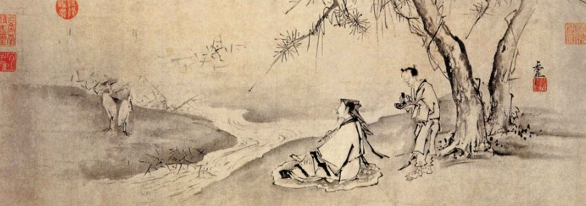
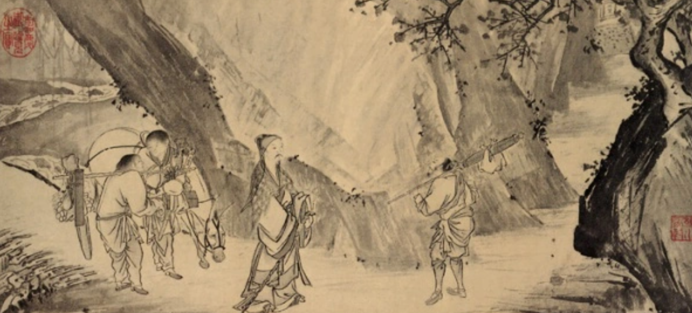
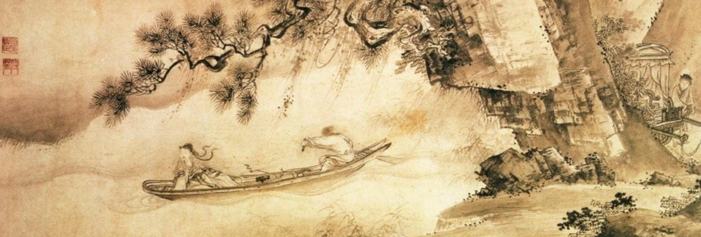
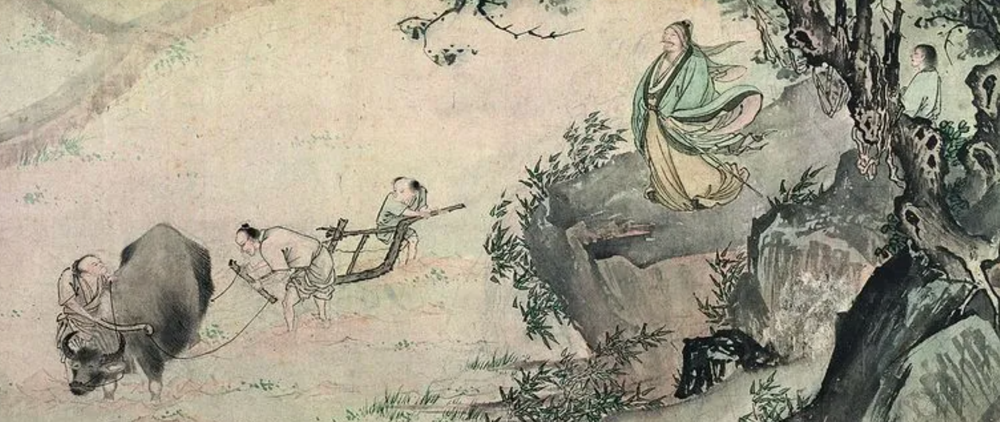

# 归去来兮辞

**作者:** 陶渊明

---

归去来兮,田园将芜胡不归?既自以心为形役,奚惆怅而独悲?悟已往之不谏,知来者之可追。实迷途其未远,觉今是而昨非。舟遥遥以轻飏,风飘飘而吹衣。问征夫以前路,恨晨光之熹微。

乃瞻衡宇,载欣载奔。僮仆欢迎,稚子候门。三径就荒,松菊犹存。携幼入室,有酒盈樽。引壶觞以自酌,眄庭柯以怡颜。倚南窗以寄傲,审容膝之易安。园日涉以成趣,门虽设而常关。策扶老以流憩,时矫首而遐观。云无心以出岫,鸟倦飞而知还。景翳翳以将入,抚孤松而盘桓。

归去来兮,请息交以绝游。世与我而相违,复驾言兮焉求?悦亲戚之情话,乐琴书以消忧。农人告余以春及,将有事于西畴。或命巾车,或棹孤舟。既窈窕以寻壑,亦崎岖而经丘。木欣欣以向荣,泉涓涓而始流。善万物之得时,感吾生之行休。

已矣乎!寓形宇内复几时?曷不委心任去留?胡为乎遑遑欲何之?富贵非吾愿,帝乡不可期。怀良辰以孤往,或植杖而耘耔。登东皋以舒啸,临清流而赋诗。聊乘化以归尽,乐夫天命复奚疑!

---

## 赏析

《归去来兮辞》是东晋诗人陶渊明的代表作之一,写于义熙元年(公元405年),是诗人辞去彭泽县令、回归田园时所作。这篇辞赋以归乡为线索,抒发了诗人对官场的厌倦和对田园生活的向往。

### 意象解读

**田园将芜** - 荒废的家园,象征诗人对官场的失望
**心为形役** - 精神被形体所役使,指为官场生活所累
**舟遥遥** - 归心似箭,轻舟快意
**三径就荒,松菊犹存** - 虽然荒废,但高洁品格依旧
**云无心以出岫** - 云朵无心飘出山峦,象征自由自在
**鸟倦飞而知还** - 倦鸟知还,比喻诗人回归田园
**木欣欣以向荣** - 万物生机勃勃,与官场的死气沉沉形成对比

### 主题思想

全诗通过"归去来兮"的反复咏叹,表达了诗人对官场生活的彻底决裂和对田园生活的无限向往。诗人认识到"悟已往之不谏,知来者之可追",毅然辞官归隐,追求心灵的自由和精神的超脱。这不仅是个人的选择,更是对当时黑暗现实的抗议。

### 艺术特色

- **结构精巧**: 全文以"归去来兮"为线索,层层递进,结构完整
- **语言优美**: 骈散结合,音韵和谐,朗朗上口
- **情景交融**: 将归乡的喜悦、田园的恬静与内心的感悟完美融合
- **对比鲜明**: 官场的黑暗与田园的美好形成强烈对比
- **哲理深刻**: "寓形宇内复几时"等句蕴含人生哲理

---

## 背景故事

陶渊明(约365-427年),字元亮,号五柳先生,东晋末至南朝宋初期伟大的诗人、辞赋家。他出身于没落的士族家庭,曾任江州祭酒、镇军参军、彭泽县令等职。

公元405年,陶渊明任彭泽县令,在任仅八十余天。当时郡里派督邮来县巡视,县吏告诉陶渊明应该穿戴整齐去迎接。陶渊明叹息道:"我岂能为五斗米折腰向乡里小儿!"于是辞官归隐,写下这篇著名的《归去来兮辞》。

陶渊明归隐后,过着"采菊东篱下,悠然见南山"的田园生活,创作了大量优秀的田园诗,成为中国田园诗派的创始人。他的诗歌和散文对后世产生了深远影响。

---

## 名家评论

> "《归去来兮辞》是陶渊明的代表作,全文情景交融,语言优美,意境深远。'云无心以出岫,鸟倦飞而知还'两句,堪称千古名句。"
> —— 苏轼

> "陶渊明的《归去来兮辞》不仅是一篇优秀的辞赋,更是一篇人生的宣言。它告诉我们,要勇于追求心灵的自由,不为名利所累。"
> —— 朱熹

> "归去来兮,不但是陶渊明个人的选择,更是中国文人精神的一种象征。它代表了对自由的向往,对真我的追求。"
> —— 鲁迅

---

## 扩展阅读

### 陶渊明的其他名作

- **《桃花源记》** - 描绘了一个理想中的世外桃源,表达了对美好社会的向往
- **《饮酒·其五》** - "采菊东篱下,悠然见南山"是其中的名句
- **《归园田居·其一》** - "少无适俗韵,性本爱丘山"表达了诗人对田园生活的热爱

### 相关主题

陶渊明的归隐思想对后世文人产生了深远影响。唐代诗人王维、孟浩然等都受到他的影响,创作了大量山水田园诗。宋代苏轼更是对陶渊明推崇备至,写下大量和陶诗。

"不为五斗米折腰"的故事也成为中国文人精神的象征,激励着一代又一代的知识分子坚持气节,不为权势所屈。
