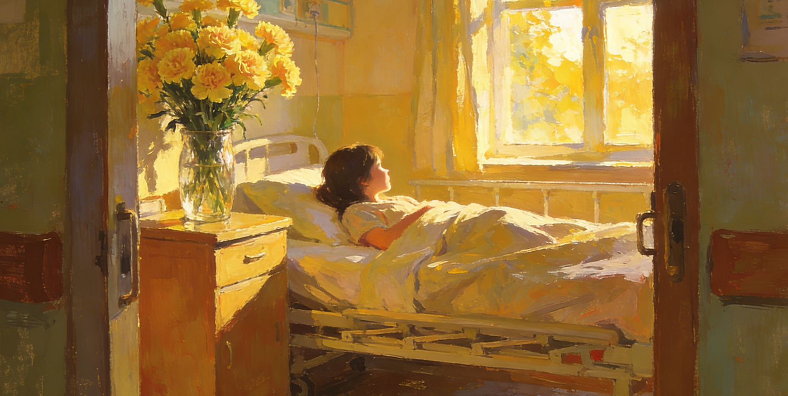

# 滴露的康乃馨

真情莫过共握手！——题记

---

虚掩的房门"咯吱"一声开了一道缝隙，爸探进半个脑袋向里张望。天刚亮，同房的病友可能正在梦乡。我刚醒，缩着身子用被角半掩着脸。没错，是爸！

红的，一大束康乃馨，我惊呆了。那天，爸依旧是穿着那身泛白的工作服，头发很凌乱，或许外面风大。清早的雾水打湿了他的发尖，脸上似乎还带着风的痕迹,看起来比以前沧桑了许多。然而，我禁不住想笑，爸的样子笨拙而滑稽，他那一身装扮与他胸前一大束康乃馨极不相称。我总以为，鲜花该是有着某种浪漫和情调。爸朝我这边走来，我咧着嘴躲在被角里偷偷地笑。"哦，醒了。"爸惊诧的表情让我知道我是多么爱睡懒觉。"嗯，可是老爸，您这花是给我的？"我还是有点狐疑。这一问，爸反倒有点紧张，两只手不停地换着拿花，脸上泛起了红晕，慌乱地点了点头。"昨天还和你妈商量着买什么，后来你妈说你喜欢康乃馨。一大早我就到花店拣了几束新鲜的，只是店主将它包装得太鲜艳……"爸停住了，他可能真的不习惯这种送花的场合。

爸翻遍了抽屉终于找到了一个插花的瓶子，很脏。没等我说话，爸已放下了花一路小跑着出去。我端详着那一大束火红的康乃馨，竟不知怎么已被感动了。我又想起了出事的那天，妈的慌乱，爸的平静。腿摔成了骨折，都怪我骑车太粗心。当时只记得一阵巨痛，腿再也拿不动了。医院的急诊室在四楼，电梯口挤满了人。我知道爸妈是担心我病情严重才决定上急诊室。爸背着我急匆匆地爬楼梯，一路上没歇过。伏在爸的肩上，我清清楚楚地看清了他脸上的汗珠。爸的身体很单薄，可背我的时候我分明感到了他的力量。四楼，我不知那长长的楼道有多少阶，也没有目睹爸将我送进急诊室后的气喘吁吁。那绝不是一段好走的路……爸捧着花瓶进来了，脸上是憨厚的笑。那一刻，我有一种想哭的感觉。人说，朴素的爱却是最伟大的。我恍然明白，其实爸从来没有给过我富丽堂皇的爱。我和他的故事没有影片上的轰轰烈烈。我的童年，他的爱是交给了三月里高飞的风筝，黑眼睛的小鲫鱼……点点滴滴地用温暖包围我长大。

不知何时，爸已插好了康乃馨，一个人憨憨地在排列每朵花的顺序。左边、右边、向上、向下。我静静地凝望他，感受满屋里清晨的祝福。花瓣上，一滴露珠滑落了下来。微妙的情感里，康乃馨也懂得为我流泪。

……我渐渐地睡着了，迷迷糊糊有一双手将我的手轻握，我没有睁开眼，然而我的眼泪却终于不争气地流了一满脸。

---




## 赏析

### 开篇细节

**"虚掩的房门'咯吱'一声开了一道缝隙"**

文章从一个简单的动作开始，"咯吱"声、"一道缝隙"、"探进半个脑袋"，这些细节将父亲小心翼翼的关爱具象化。清晨时分，怕打扰病友，怕惊醒女儿，这种细腻的体贴正是父爱的真实写照。

### 人物刻画

#### 父亲形象
- **外貌描写**：泛白的工作服、凌乱的头发、被雾水打湿的发尖、比以前沧桑的脸
- **神态动作**：笨拙而滑稽、紧张地换着拿花、脸上泛起红晕、憨厚的笑
- **性格特点**：朴实、不善表达、细心（与妈妈商量）、行动力强（一大早就去买花）
- **情感表达**：不习惯浪漫的方式，但用最真诚的行动表达爱

#### "我"的心理变化
1. **初见** - 惊呆（没想到爸会送花）
2. **观察** - 想笑（爸的样子与花不相称）
3. **狐疑** - 不敢相信（"您这花是给我的？"）
4. **回忆** - 感动（想起爸背我上四楼）
5. **领悟** - 流泪（明白父爱的真谛）

### 主题思想

#### 1. 朴素的父爱
**"朴素的爱却是最伟大的"**

文章通过一束康乃馨的小事，揭示了父爱的本质：不需要华丽的辞藻，不需要轰轰烈烈的场面，只需要真心实意的陪伴和关怀。

#### 2. 爱的细节
- 一大早去花店挑选新鲜的花
- 与妈妈商量买什么礼物
- 背"我"爬四楼楼梯时的汗珠
- 小跑着去洗花瓶
- 憨憨地排列每朵花的顺序
- 最后轻握"我"的手

#### 3. 成长中的感悟
从笑话父亲的"笨拙"到理解父爱的深沉，"我"在这个过程中完成了一次情感的成长和升华。

### 艺术特色

#### 1. 对比手法
- **外表与内心**：爸的装扮与花不相称 vs 爸的真心关爱
- **过去与现在**：童年的风筝、小鲫鱼 vs 现在的康乃馨
- **母亲与父亲**：妈的慌乱 vs 爸的平静
- **期待与现实**："鲜花该是有着某种浪漫" vs 朴实无华的父爱

#### 2. 细节描写生动
- **视觉**：泛白的工作服、凌乱的头发、火红的康乃馨
- **听觉**："咯吱"一声
- **动作**：探头、换着拿花、小跑、排列花朵
- **神态**：脸上泛起红晕、憨厚的笑

#### 3. 插叙手法
在看着康乃馨的时候，插叙了受伤当天爸背"我"上四楼的情景，这个回忆深化了对父爱的理解，也为情感的爆发做了铺垫。

#### 4. 象征意义
- **康乃馨** - 传统上象征母爱，在这里却成为父爱的载体，别具深意
- **滴露** - 露珠滑落象征着泪水，康乃馨"懂得为我流泪"，物我合一
- **握手** - 题记中的"真情莫过共握手"，最后父亲轻握"我"的手，呼应主题

### 情节发展

1. **清晨探望** - 父亲带着康乃馨出现
2. **尴尬时刻** - 父亲不习惯送花的场合
3. **插花细节** - 父亲细心地整理花朵
4. **回忆往事** - 想起父亲背我上楼的情景
5. **情感升华** - 理解父爱，感动落泪

### 情感层次

文章的情感发展呈现递进关系：

```
惊讶 → 好笑 → 狐疑 → 感动 → 领悟 → 流泪
```

这种层层递进的情感变化，使得最后的泪流满面显得真实而动人。

### 语言特色

#### 1. 口语化与书面语结合
- 口语："哦，醒了"、"老爸"、"您这花是给我的？"
- 书面语："虚掩"、"憨憨地"、"微妙的情感"

#### 2. 细腻的心理描写
- "我禁不住想笑"
- "我还是有点狐疑"
- "竟不知怎么已被感动了"
- "那一刻，我有一种想哭的感觉"

#### 3. 富有诗意的表达
- "清早的雾水打湿了他的发尖"
- "三月里高飞的风筝，黑眼睛的小鲫鱼"
- "满屋里清晨的祝福"
- "微妙的情感里，康乃馨也懂得为我流泪"

---

## 现实启示

### 对父爱的重新认识

#### 父爱的特点
1. **内敛含蓄** - 不善于用语言表达，更多通过行动
2. **实在具体** - 背我上楼、洗花瓶、整理花朵，都是实实在在的关怀
3. **细腻体贴** - 与妈妈商量、一大早去买花、怕吵醒病友
4. **默默付出** - "我"睡着后仍然守护在旁边

#### 如何理解父爱
- 不要用表面的"浪漫"来衡量父爱
- 学会从生活细节中发现父亲的关怀
- 理解父亲不善表达背后的深情
- 珍惜父亲"笨拙"的爱的表达

### 对亲情的感悟

#### 1. 爱需要表达
虽然父亲不善表达，但他仍然努力用自己的方式（买花、送花）来表达爱。我们也应该学会表达对父母的爱。

#### 2. 沟通的重要性
- 妈妈告诉爸"我"喜欢康乃馨
- 这种沟通让父亲的爱能够更准确地传达

#### 3. 理解与感恩
- 从笑话到感动的转变，体现了理解的力量
- 看到父亲的付出，才能真正感恩

### 对成长的思考

#### 1. 感知能力的提升
随着成长，我们需要提高对父母之爱的感知能力，不要等到失去才后悔。

#### 2. 换位思考
- 父亲"笨拙而滑稽"的样子，其实是走出舒适区的表现
- 他为了"我"，做了平时不会做的事

#### 3. 珍惜当下
- 父亲"看起来比以前沧桑了许多"
- 父母在渐渐老去，要珍惜陪伴的时光

---

## 经典句子品读

### "真情莫过共握手！"
题记开门见山，点明主题。握手，一个简单的动作，却是心与心最直接的交流。文末父亲轻握"我"的手，与题记形成完美呼应。

### "红的，一大束康乃馨，我惊呆了"
短促的句子，传神地写出了"我"的惊讶。康乃馨通常象征母爱，父亲送康乃馨的反差，增添了文章的独特性。

### "爸的样子笨拙而滑稽，他那一身装扮与他胸前一大束康乃馨极不相称"
这种"不相称"恰恰是文章的动人之处。父亲为了女儿，做了平时不会做的事，这种反差正是爱的证明。

### "朴素的爱却是最伟大的"
文章的点睛之笔。父爱不需要华丽的包装，最朴素的关怀，才是最真挚、最伟大的爱。

### "我的童年，他的爱是交给了三月里高飞的风筝，黑眼睛的小鲫鱼……点点滴滴地用温暖包围我长大"
诗意的语言，勾勒出童年的美好回忆。父爱就在这些平凡的日常中，像温暖的阳光，默默包围着孩子成长。

### "花瓣上，一滴露珠滑落了下来。微妙的情感里，康乃馨也懂得为我流泪"
借物抒情，将自己的泪水投射到康乃馨上。露珠与泪水的重叠，是情感的外化，也是物我交融的美妙瞬间。

### "我渐渐地睡着了，迷迷糊糊有一双手将我的手轻握"
文章的结尾含蓄而动人。没有正面描写父亲的守候，却通过"轻握"这个细节，让读者感受到父爱的温柔与深沉。

### "我没有睁开眼，然而我的眼泪却终于不争气地流了一满脸"
"不争气"三个字，透露出"我"想要克制却无法克制的情感。这种真情流露，是对父爱最好的回应。

---

## 写作启示

### 1. 以小见大
一束康乃馨这样的小事，却能反映出深沉的父爱。生活中的小细节，往往蕴含着最真挚的情感。

### 2. 细节的力量
- 泛白的工作服
- 雾水打湿的发尖
- 两只手不停地换着拿花
- 脸上泛起的红晕
- 憨憨地排列花朵

这些细节让人物形象鲜活生动，让情感真实可感。

### 3. 对比衬托
通过"我"前后态度的对比，通过父亲外表与鲜花的对比，通过期待与现实的对比，深化了主题。

### 4. 情感的真实性
文章不避讳"我"起初的"想笑"和"狐疑"，这种真实的心理描写，使得后来的感动更加真实可信。

---

这篇文章以质朴的笔触，记录了父爱的一个瞬间，却让我们看到了父爱的永恒。正如那束康乃馨上的露珠，晶莹剔透，映照出最纯粹的真情。
